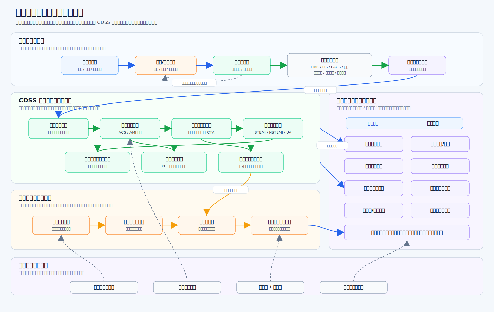
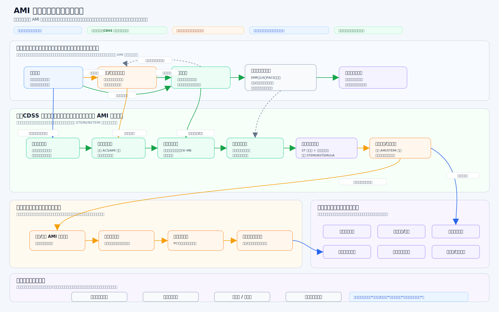

# 专病辅助诊疗建设方案：以急性心肌梗死（AMI）为例

版本：V2.1  
日期：2026-07-16  
适用范围：专科辅助诊疗、专科 CDSS、专科知识库建设、电子病历辅助应用

## 1. 核心背景

现有通用诊疗辅助系统多以基础知识提示和通用规则提醒为主，缺少面向具体专科、具体病种的专属诊疗流程和规则支撑。专科知识、临床业务流程、合理性提醒和质控要求相互分散，容易导致专科辅助诊疗碎片化、流程不统一、提醒不连续。

为满足电子病历六级中对专科疾病推荐、专科医嘱推荐、专科治疗方案推荐、专科评估、风险预测、专科模板推荐和专科医嘱质控等能力要求，需建设面向重点专科的辅助诊疗体系。系统以专科知识库为基础，结合患者全周期诊疗数据，在医生诊疗过程中提供辅助诊断、方案推荐、风险提示、模板推荐和医嘱质控提醒。

本阶段先以不少于 1 个重点专科或重点专病为样板开展建设。本文以急性心肌梗死（AMI）为示例，说明专科辅助诊疗能力如何落地。

### 1.1 六级评级对标要求

本项目重点对标以下建设要求：

| 序号 | 评级要求 | 本项目建设内容 |
|---|---|---|
| 1 | 支持专科疾病推荐、鉴别方法推荐、专科医嘱推荐 | 建设疾病提示、鉴别诊断提示、检查检验和用药医嘱建议 |
| 2 | 支持病因分析 | 结合病史、危险因素、检查检验结果，提示可能病因或诱因 |
| 3 | 支持专科治疗方案推荐 | 根据专病诊疗规范，提供治疗方案参考 |
| 4 | 支持专科评估 | 支持病情评估、风险评估、治疗条件评估 |
| 5 | 支持基于专科疾病模型进行风险预测 | 基于专科规则和风险因素，提供疾病进展、并发症和治疗风险提示 |
| 6 | 至少具备不少于 1 个专科诊疗体系 | 以 AMI 为示例建设专病辅助诊疗体系 |
| 7 | 支持专科模板推荐 | 根据患者病情和诊疗阶段推荐专科病历、评估或随访模板 |
| 8 | 支持手术及评估模板推荐 | 针对手术或介入治疗场景，推荐相关术前评估、知情、记录和术后观察模板 |
| 9 | 支持专科医嘱质控 | 结合指南、诊疗规范和患者数据，对不合理医嘱给出提醒 |

### 1.2 评级场景对应关系

| 业务场景 | 智慧医疗评级 | 主要评价内容 | 功能建设内容 |
|---|---|---|---|
| 病房医嘱处理 | 六级-01.01.6（4） | 有专科医嘱字典；下达医嘱时，可利用患者诊疗数据、专科知识库及医师主观描述，包括病历、体征、检查、检验、用药等，综合进行诊疗方案推荐，并对不合理医嘱实时给出提示。 | 1. 专科疾病智能识别推荐功能；2. 专科医嘱智能推荐功能；3. 专科医嘱合理性提醒功能。 |
| 处方书写 | 六级-03.01.6（4） | 建立针对不同专科、病种的诊疗模型，结合患者全周期数据，形成风险预测模型。 | 1. 专科疾病病因分析功能；2. 专病风险评估与提示功能；3. 用药风险提示功能。 |
| 知识获取及管理 | 六级-12.02.6（6） | 医疗机构不少于 1 个专科，重点专科优先，具备专科数据库，并纳入医疗机构知识库统一管理。 | 1. 专科知识库建设；2. 专病知识结构整理；3. 指南、诊疗规范和临床路径依据管理。 |
| 病房病历记录 | 六级-01.04.6（2） | 可根据患者情况智能推荐专科模板；可根据患者全周期诊疗数据，包括病史、体征、检查、检验、用药、护理记录等，对书写内容进行智能检查与提示。 | 1. 专科病历模板推荐功能；2. 专科评估模板推荐功能；3. 书写内容完整性检查与提示功能。 |

中医病历相关四诊和证候规则不纳入本阶段建设范围。

## 2. 建设目标

本项目围绕专科辅助诊疗场景，基于医院现有电子病历、检查检验、医嘱、用药及诊疗过程数据，结合专科指南、临床路径、诊疗规范和专家经验，建设面向医生诊疗过程的专科辅助诊疗能力。

系统不替代医生诊断和治疗决策，主要作为医生诊疗过程中的辅助工具，为医生提供疾病提示、诊断依据、检查建议、治疗方案参考、风险提示和合理性提醒，帮助医生提高诊疗效率，减少遗漏，规范诊疗行为。

本方案以急性心肌梗死（AMI）为示例，说明专科辅助诊疗系统如何围绕一个专病开展知识整理、规则建设和临床应用。

## 3. 建设思路

传统方式建设专科辅助诊疗知识库，通常需要人工逐条阅读指南、教材和临床路径，再手工整理疾病、症状、检查、检验、药物、治疗方案、诊断标准和指南依据，工作量大、周期长，也容易出现遗漏。

引入 AI 后，可辅助完成医学资料梳理、知识归类、规则初步整理和结构化录入，形成专科辅助诊疗知识底座。人工专家主要负责审核和确认关键医学内容，减少重复整理工作，提高知识库建设效率。

整体建设思路为：

```text
专科资料整理
  -> 专科知识结构化
  -> 辅助诊疗规则梳理
  -> 与患者诊疗数据结合
  -> 输出辅助诊断、治疗建议、风险提示和合理性提醒
```

## 4. 建设内容

### 4.1 专科辅助诊疗推荐

专科辅助诊疗按照“先识别、再鉴别、后进入专病流程、再治疗”的顺序建设，完整业务链路为：

**疑似疾病识别 → 初筛鉴别检查 → 分型确诊 → 专病流程准入 → 流程内专项检查 → 标准化治疗方案推荐 → 介入/手术围术期提醒 → 治疗质控与随访**

其中，专科知识图谱主要负责前置判断，包括“患者像不像这个专病、还需要做哪些初筛检查、最终属于什么分型”；专病流程引擎主要负责患者进入专病流程后的标准化管理，包括“该阶段做什么检查、用什么治疗方案、是否需要介入或手术评估、术前术中术后需要关注什么、哪些动作需要质控提醒”。

### 4.1.0 图谱、规则引擎、专病流程引擎的边界

| 层级 | 负责内容 | 不负责内容 |
|---|---|---|
| 专科知识图谱 | 疾病、症状体征、诊断标准、鉴别诊断、检查检验、治疗方案、药物手术、推荐、证据和指南来源 | 不直接判断当前患者一定要执行某医嘱 |
| 规则引擎 | 根据患者数据判断触发条件、排除条件、禁忌证和风险等级 | 不维护原始指南全文，不替代图谱证据链 |
| 专病流程引擎 | 管理诊疗阶段、阶段顺序、阶段候选动作、表单模板、医嘱质控和随访节点 | 不把所有疾病邻居节点一次性展示给医生 |

落地要求：

1. 疾病图谱页面可以展示全量知识，用于探索和审核。
2. 正式 CDSS 页面只展示当前阶段、当前患者命中的正式推荐。
3. 治疗方案节点如果没有药物、手术、检查、禁忌、规则或证据下游，只能作为知识节点，不得作为正式推荐。
4. 医生点击推荐动作时，只显示该推荐自己的主证据，不显示疾病全部证据池。
5. 每个新批次写库后必须通过“入库后复测”，否则不能交给前端作为正式 CDSS 数据源。

#### 4.1.1 专科知识图谱：疑似疾病识别

系统提取患者主诉、现病史、既往史、体征、生命体征等初诊信息，与专科疾病知识库中的症状、体征、危险因素进行匹配，自动识别患者可能涉及的专科疾病大类，作为后续辅助诊疗推荐的起点。

以 AMI 为例，患者录入“胸痛2小时、出汗、恶心呕吐，既往有高血压、糖尿病”后，系统优先识别为 ACS/AMI 相关疑似疾病，并提示医生需要进一步完善心电图、心肌肌钙蛋白等检查。此阶段只做“疑似疾病推荐”，不直接给出最终确诊。

#### 4.1.2 专科知识图谱：初筛辅助检查推荐

系统根据已识别的疑似疾病，推荐进入专病流程前必须完善的基础鉴别检查，用于获取客观检验、检查依据，支撑医生完成初步排查和诊断判断。

以疑似 AMI 为例，系统推荐心电图、心肌肌钙蛋白、肌酸激酶同工酶、超声心动图等基础检查，同时提示需要鉴别主动脉夹层、肺栓塞、急性心包炎等胸痛相关疾病。此阶段重点是“补齐诊断依据”，不是直接进入治疗流程。

#### 4.1.3 专科知识图谱：分型辅助诊断推荐

当初筛检查结果回填后，系统结合疑似疾病、心电图、心肌标志物等结果进行综合判断，辅助医生完成疾病确诊和分型判断，并作为是否进入专病流程的准入依据。

以 AMI 为例，如果心电图提示 ST 段抬高，并伴随肌钙蛋白升高，系统可推荐 STEMI 分型；如果肌钙蛋白动态升高但无 ST 段抬高，可推荐 NSTEMI 分型；如果胸痛明确但心肌标志物未达到心梗标准，则可提示不稳定型心绞痛等方向。也就是说，**诊断分型应放在检查检验结果回填之后推荐，不建议在一开始录入主诉时直接推荐 STEMI/NSTEMI。**

#### 4.1.4 专病诊疗流程：标准化专科检查

患者完成确诊或分型判断后，系统根据准入条件提示创建对应专病流程候选，并按照流程节点推送后续专项检查，用于评估病情严重程度、治疗风险和质控要求。

以 ST 段抬高型心肌梗死（STEMI）为例，进入急性心肌梗死（AMI）专病流程后，系统可根据流程节点推荐冠状动脉造影、心功能评估、出血风险评估、肾功能评估等专项检查，并对关键检查是否完成进行过程质控提醒。

#### 4.1.5 专病诊疗流程：标准化治疗方案

系统结合确诊分型、检查结果、风险评估结果和患者禁忌信息，推荐符合指南和院内规范的治疗方案，并对医嘱、用药、介入或手术治疗进行质控提醒。

以 ST 段抬高型心肌梗死（STEMI）为例，系统根据发病时间、经皮冠状动脉介入治疗（PCI）条件、出血风险、过敏史等信息，推荐急诊经皮冠状动脉介入治疗（PCI）评估、静脉溶栓治疗评估、抗血小板治疗评估、抗凝治疗评估、调脂治疗评估等方案，并提示禁忌证、缺失检查和不合理医嘱风险。

#### 4.1.6 专病诊疗流程：介入/手术围术期管理

系统在患者进入专病流程并触发介入或手术治疗建议后，根据治疗方式、检查结果、风险评估和禁忌信息，推荐术前评估、术中关注事项、术后观察要点和并发症风险提醒，辅助医生补齐围术期关键记录和质控要求。

以 ST 段抬高型心肌梗死（STEMI）为例，若系统推荐急诊经皮冠状动脉介入治疗（PCI）评估，则同步提示完善介入治疗术前评估、造影剂过敏史、肾功能、凝血功能、出血风险评估和知情同意记录；术中关注冠状动脉造影结果、罪犯血管、血流恢复情况、支架植入情况和术中并发症；术后关注穿刺点出血、再发胸痛、心律失常、心力衰竭、低血压、肾功能变化等风险，并提醒补齐 PCI 术后风险评估表、穿刺点观察表或并发症观察表，以及相关医嘱质控提醒。

### 4.2 AMI 详细规则配置案例

为便于规则配置和系统调用，本节将 4.1 中提到的 AMI 业务链路拆成可配置规则。每条规则均应明确规则名称、触发阶段、读取字段、判断条件、输出内容和使用边界，便于配置人员按规则名称和业务阶段维护，系统按对应业务动作调用。

#### 4.2.1 规则一：急性心肌梗死（AMI）疑似疾病识别规则

规则逻辑：当主诉字段包含“胸痛”“胸闷”“胸骨后疼痛”任一内容，或现病史字段包含“压榨样疼痛”“持续不缓解”“出汗”“恶心呕吐”“肩背部放射痛”任一内容时，系统输出急性冠脉综合征（ACS）/急性心肌梗死（AMI）疑似疾病候选；当既往史字段包含“高血压”“糖尿病”“冠心病史”，个人史字段包含“吸烟”，家族史字段包含“早发冠心病家族史”时，仅作为风险背景展示和加权依据，不单独触发 AMI 疑似疾病，不在该阶段输出最终确诊或 ST 段抬高型心肌梗死（STEMI）/非 ST 段抬高型心肌梗死（NSTEMI）分型。

#### 4.2.2 规则二：急性心肌梗死（AMI）初筛检查推荐规则

规则逻辑：当系统已生成急性冠脉综合征（ACS）/急性心肌梗死（AMI）疑似疾病，或医生点击关注急性冠脉综合征（ACS）/急性心肌梗死（AMI）疑似疾病后，系统检查患者本次就诊是否已有“心电图”报告、“心肌肌钙蛋白”检验结果、“肌酸激酶同工酶”检验结果和“超声心动图”报告；若任一项目缺失，则推荐补做对应项目，并在推荐原因中标明“用于判断 ST 段改变、心肌损伤标志物升高、心肌损伤动态变化和室壁运动异常”，该规则只用于补齐初筛诊断依据，不表示患者已经进入治疗流程。

#### 4.2.3 规则三：胸痛鉴别诊断提示规则

规则逻辑：当患者存在急性冠脉综合征（ACS）/急性心肌梗死（AMI）疑似疾病且主诉或现病史包含“胸痛”时，系统检查是否已有“主动脉 CT 血管成像（CTA）”报告结论、“肺动脉 CT 血管成像（CTA）”报告结论和“心电图”报告结论；若主动脉 CT 血管成像（CTA）结论未见“主动脉夹层阴性/未见夹层”，则提示需鉴别主动脉夹层；若肺动脉 CT 血管成像（CTA）结论未见“肺栓塞阴性/未见肺动脉栓塞”，则提示需鉴别肺栓塞；若心电图报告结论出现“弥漫性 ST 段抬高”或“PR 段压低”，则提示需鉴别急性心包炎；该规则只提示鉴别方向和缺失依据，不自动排除或确诊鉴别疾病。

#### 4.2.4 规则四：急性心肌梗死（AMI）分型辅助诊断规则

规则逻辑：当“心电图”报告的检查所见或诊断结论字段包含“ST段抬高”，且检验报告中项目名称为“心肌肌钙蛋白”的结果值高于该项目参考范围上限，或同一患者两次“心肌肌钙蛋白”结果按采样时间排序后后一次结果值高于前一次结果值时，系统输出“支持急性心肌梗死（AMI），倾向 ST 段抬高型心肌梗死（STEMI）”，并展示命中依据为心电图 ST 段抬高和心肌肌钙蛋白升高；当检验报告中项目名称为“心肌肌钙蛋白”的结果值高于参考范围上限或后一次结果值高于前一次结果值，但心电图报告未包含“ST段抬高”时，系统输出“支持急性心肌梗死（AMI），倾向非 ST 段抬高型心肌梗死（NSTEMI）”；当患者存在缺血性胸痛且心电图提示缺血改变，但心肌肌钙蛋白结果值未高于参考范围上限且未出现后一次高于前一次时，系统输出“不稳定型心绞痛待排”；该规则必须在心电图和心肌肌钙蛋白结果回填后触发，不能仅凭主诉直接触发分型。

#### 4.2.5 规则五：急性心肌梗死（AMI）专病流程准入规则

规则逻辑：当辅助诊断结果为“支持急性心肌梗死（AMI），倾向 ST 段抬高型心肌梗死（STEMI）”且医生点击确认或关注该诊断时，系统读取心电图报告结论、心肌肌钙蛋白检验结果、发病时间字段和胸痛开始时间字段；若心电图报告结论包含“ST段抬高”、心肌肌钙蛋白高于参考上限或存在动态升高、发病时间或胸痛开始时间可明确，则提示创建 AMI 专病流程候选并定位到“再灌注评估阶段”；该规则只判断是否进入专病流程和定位流程阶段，不直接生成治疗医嘱。

#### 4.2.6 规则六：ST 段抬高型心肌梗死（STEMI）再灌注专项评估规则

规则逻辑：当患者进入 AMI 专病流程并处于再灌注评估阶段时，系统读取胸痛开始时间、当前时间、经皮冠状动脉介入治疗（PCI）可及时间、活动性出血记录、近期脑出血史、血肌酐检验结果、造影剂过敏史和阿司匹林过敏史；若胸痛开始时间至当前时间小于等于 12 小时且经皮冠状动脉介入治疗（PCI）可及时间小于等于 90 分钟，则在评估记录中提示“优先评估急诊经皮冠状动脉介入治疗（PCI）”；若经皮冠状动脉介入治疗（PCI）可及时间大于 90 分钟，则在评估记录中提示补充“静脉溶栓治疗适应证评估”和“静脉溶栓治疗禁忌证评估”；若活动性出血记录为“是”、近期脑出血史为“是”、造影剂过敏史为“是”或血肌酐结果值高于参考范围上限，则同步输出风险提示和缺失评估项。

#### 4.2.7 规则七：ST 段抬高型心肌梗死（STEMI）标准化治疗建议规则

规则逻辑：当分型辅助诊断结果为 ST 段抬高型心肌梗死（STEMI）且再灌注评估提示经皮冠状动脉介入治疗（PCI）可及时间小于等于 90 分钟、活动性出血为否、近期脑出血史为否时，系统输出治疗建议“急诊经皮冠状动脉介入治疗（PCI）评估”，对应可配置为介入治疗申请/手术操作建议，不直接自动生成医嘱；当经皮冠状动脉介入治疗（PCI）可及时间大于 90 分钟且静脉溶栓治疗禁忌证评估为无禁忌时，系统输出治疗建议“静脉溶栓治疗评估”，对应可配置为治疗方案建议和溶栓评估记录；当过敏史未记录阿司匹林过敏且活动性出血为否时，系统输出医嘱建议“抗血小板治疗评估”，可关联阿司匹林、氯吡格雷或替格瑞洛等抗血小板药物医嘱；当出血风险未标记为高危且无活动性出血时，系统输出医嘱建议“抗凝治疗评估”，可关联普通肝素或低分子肝素等抗凝药物医嘱；当血脂检查中项目名称为“低密度脂蛋白胆固醇（LDL-C）”的结果值已回填时，系统输出医嘱建议“调脂治疗评估”并展示 LDL-C 结果值，可关联他汀类调脂药物医嘱；当 LDL-C 结果未回填时，系统仍输出“调脂治疗评估”，但提示缺少 LDL-C 检验依据；该规则输出的是辅助治疗建议、可关联医嘱类型和阻断原因，最终处置由医生确认。

#### 4.2.8 规则八：急性心肌梗死（AMI）医嘱质控与评估表单提醒规则

规则逻辑：当患者处于 AMI 专病流程内时，系统检查当前阶段是否已完成心电图、心肌肌钙蛋白、肌酸激酶同工酶、血肌酐、血糖、血脂和超声心动图；若缺少心电图或心肌肌钙蛋白，则在质控提醒中提示关键诊断依据缺失；若已开立阿司匹林、氯吡格雷、替格瑞洛、普通肝素或低分子肝素等抗血小板/抗凝药物医嘱，但活动性出血记录为“是”，则在医嘱质控中提示用药风险；若患者进入再灌注评估、PCI 术前、PCI 术中或 PCI 术后阶段，系统检查对应评估表单是否已生成、已填写或超期，未完成时提醒补齐对应评估表单；该规则只做过程质控和评估表单提醒，不生成病程记录书写内容，不替代医院既有医嘱审核。

#### 4.2.9 规则九：ST 段抬高型心肌梗死（STEMI）经皮冠状动脉介入治疗（PCI）术前评估提醒规则

规则逻辑：当分型辅助诊断结果为 ST 段抬高型心肌梗死（STEMI），且治疗建议包含急诊经皮冠状动脉介入治疗（PCI）评估时，系统检查是否已记录造影剂过敏史、阿司匹林过敏史、活动性出血记录、近期脑出血史、血肌酐、凝血功能、血常规、出血风险评估、介入治疗术前评估记录和介入治疗知情同意记录；若任一项目缺失，则在介入/手术术前提醒中提示补齐对应内容，并标记为经皮冠状动脉介入治疗（PCI）前需关注事项，不直接阻断急危重症救治流程。

#### 4.2.10 规则十：ST 段抬高型心肌梗死（STEMI）经皮冠状动脉介入治疗（PCI）术中关注事项提醒规则

规则逻辑：当患者已进入经皮冠状动脉介入治疗（PCI）相关流程节点时，系统提示医生关注冠状动脉造影结果、罪犯血管、术中血流恢复情况、支架植入情况、术中低血压、恶性心律失常、无复流、急性血栓形成和术中出血等事项，并检查 PCI 术中关注事项评估表是否已生成、已填写或超期；未完成时生成表单提醒，用于提示术中关注事项和并发症观察，不生成手术记录书写内容。

#### 4.2.11 规则十一：急性心肌梗死（AMI）介入治疗术后并发症观察与质控提醒规则

规则逻辑：当患者完成经皮冠状动脉介入治疗（PCI）或冠状动脉造影后，系统读取穿刺点观察、心电监测、心肌标志物复查、血肌酐复查、抗血小板/抗凝治疗医嘱和生命体征；若出现再发胸痛、低血压、心律失常、心力衰竭、穿刺点出血或血肌酐升高，则提示术后并发症风险；若 PCI 术后风险评估表、穿刺点观察表或并发症观察表未完成，则提醒补齐对应评估表单，并输出相关医嘱质控提醒。

#### 4.2.12 规则维护与原型联动说明

规则列表是 AMI 规则主数据，负责维护规则名称、触发阶段、读取字段、判断条件、输出内容和使用边界；流程设计器负责把规则挂载到具体业务组件或连接线上；辅助诊疗模拟页面负责按患者当前阶段调用对应规则并展示推荐结果。

其中，规则一至规则四属于专病流程前置能力，主要在辅助诊疗模拟页中完成疑似疾病识别、初筛检查推荐、鉴别诊断提示和分型辅助诊断，不强制放入流程设计器画布；规则五用于判断是否承接 AMI 专病流程，可作为开始节点入口备注和连接线准入状态；规则六至规则十一用于患者进入 AMI 专病流程后的专项评估、治疗建议、医嘱质控、围术期提醒和评估表单提醒，需在流程设计器中配置到对应业务组件。

业务组件调用的是 4.2 中的临床业务规则，例如“再灌注专项评估规则”“标准化治疗建议规则”“PCI 术前评估提醒规则”；连接线绑定的是操作规则或状态判断，例如读取 `reperfusion_status = PRIMARY_PCI` 后进入“急诊 PCI 建议”节点，读取 `form_completion_status = REMINDER_GENERATED` 后进入下一个质控节点。连接线只读取上游业务组件的输出状态，不重复执行业务组件里的临床规则。

### 4.3 专科辅助诊疗核心边界

知识图谱负责“识别疑似疾病、推荐初筛检查、辅助分型确诊”；专病流程引擎负责“患者进入专病流程后的专项检查、治疗方案、介入/手术围术期提醒和质控闭环”。

### 4.4 专病诊疗流程引擎（编辑器）

专病诊疗流程引擎用于承接患者进入专病流程后的可视化流程设计、智能诊疗推荐、围术期提醒和过程质控闭环，适用于院内专病 CDSS 建设、国家临床路径精细化落地和单病种过程质控场景。按照 4.3 的核心边界，流程引擎不负责一开始的疑似疾病识别和分型前判断，主要负责“患者进入专病流程后，按阶段做什么、缺什么、能不能继续往下走、是否需要介入或手术提醒、哪些动作需要质控和留痕”。

#### 4.4.1 专病诊疗流程框架管理

专病诊疗流程框架用于承接 4.1.4“标准化专科检查”、4.1.5“标准化治疗方案”和 4.1.6“介入/手术围术期管理”的流程化落地，将患者进入专病流程后的检查、评估、治疗、围术期提醒、医嘱质控和评估表单提醒按诊疗阶段统一组织管理。以急性心肌梗死为例，流程框架除维护专病名称、适用科室、路径版本、启用状态、适用人群和指南依据外，还需要维护各阶段对应的专项检查项目、风险评估内容、治疗建议、术前术中术后关注事项、医嘱提醒、评估表单提醒和质控要求，确保同一专病在不同科室、不同版本下既能统一标准，又能按科室差异进行配置。

#### 4.4.2 流程引擎编辑设计

流程引擎编辑器用于把 4.1.4 中的专项检查、4.1.5 中的治疗方案和 4.1.6 中的介入/手术围术期提醒拆解到具体诊疗阶段，支持通过可视化方式配置节点顺序、节点名称、节点启用或停用、节点执行时机、节点跳转关系、节点权限控制和节点内业务内容。每个节点不仅表示流程位置，还需要明确该阶段应展示哪些检查项目、评估表单提醒、治疗建议、术前术中术后提醒、医嘱提醒和质控项。

以急性心肌梗死（AMI）为例，流程可配置为“诊断确认、分型判断、再灌注评估、专项检查补充、标准化治疗建议、介入/手术围术期提醒、医嘱质控、评估表单提醒、出院随访”等阶段。医生进入 AMI 专病流程后，系统在“专项检查补充”节点展示心电图、心肌肌钙蛋白、肌酸激酶同工酶、血肌酐、血糖、血脂和超声心动图等检查完成情况，在“标准化治疗建议”节点展示急诊经皮冠状动脉介入治疗（PCI）评估、静脉溶栓治疗评估、抗血小板治疗评估、抗凝治疗评估和调脂治疗评估，在“介入/手术围术期提醒”节点展示术前评估、知情同意、术中关注事项、术后观察和并发症风险提醒。

#### 4.4.3 整体技术架构

专病诊疗流程引擎建议由“流程设计层、规则执行层、业务组件层、状态机调度层、数据对接层”组成，用于把专科规则从“文字配置”落实到具体页面、节点和提醒动作中。

产品功能架构可按“业务系统触发、辅助推荐入口统一承接、流程引擎负责状态流转、小助手负责推荐展示”的方式理解：



流程设计层负责维护流程版本、节点顺序、连接线关系、启停状态和科室适用范围；规则执行层负责执行流程准入、分支流转、阻断判断、缺失项提示和后置动作；业务组件层负责承载专项检查清单、风险评估表单、治疗建议、介入/手术围术期提醒、医嘱提醒、评估表单提醒和随访任务；状态机调度层负责记录患者在专病流程中的当前阶段、已完成节点、待完善事项、阻断状态和流转状态；数据对接层负责读取 EMR、检查、检验、医嘱、手术/介入记录、评估表单和随访数据，并将规则执行结果回写到辅助诊疗页面、流程节点状态和过程质控记录中。

#### 4.4.4 设计器组件分类

设计器组件分为通用流程组件、业务专病组件和前置筛选能力三类，三类能力边界清晰、互不交叉，避免把专科诊疗内容配置到流程结构组件中，也避免把流程阻断逻辑配置到业务展示组件中。

通用流程组件负责流程结构、流转关系、阻断控制和分支路由，不承载临床业务内容，主要包括开始节点、结束节点、菱形分支节点和连接线。例如 AMI 流程中，“是否满足再灌注评估条件”“是否进入治疗建议节点”等流转关系由连接线控制，不在评估表单或治疗建议组件中单独配置。

业务专病组件负责临床推荐、专项检查、专科评估、治疗建议、介入/手术围术期提醒、医嘱提醒、质控提示、模板推荐和随访任务等业务输出，不承担流程阻断和路由分流能力。业务专病组件在画布中统一采用矩形节点样式，便于和分支节点区分。例如“再灌注评估组件”展示胸痛开始时间、经皮冠状动脉介入治疗（PCI）可及时间、活动性出血记录和溶栓禁忌证评估；“治疗建议组件”展示急诊经皮冠状动脉介入治疗（PCI）、静脉溶栓、抗血小板、抗凝和调脂治疗建议；“介入/手术围术期组件”展示术前评估、知情同意、术中关注事项、术后观察和并发症风险提醒。

前置筛选能力属于平台级独立能力，仅用于判断患者是否需要进入专病流程，不参与画布内流程执行。AMI 场景中，疑似疾病识别、初筛检查推荐和分型辅助诊断属于进入专病流程前的能力；患者满足准入条件后，才由流程引擎接管专项检查补充、再灌注评估、治疗建议、介入/手术围术期提醒、医嘱质控和评估表单提醒。

#### 4.4.5 组件标准化规范

开始节点和结束节点用于标识流程唯一启停入口，负责流程基础状态管控，不配置临床诊疗规则，也不展示检查、治疗或医嘱建议。

菱形分支节点仅用于流程结构展示，不直接配置业务规则和临床判断逻辑；其作用是让多分支诊疗路径更清晰，便于流程设计、阅读和维护。实际判断条件统一配置在连接线上，例如“心电图和心肌肌钙蛋白结果已回填后进入分型判断节点”“活动性出血为是时进入风险提示节点”。

连接线是流程分支、阻断、准入和后置动作的核心规则配置载体。所有分流逻辑、阻断条件、节点准入条件和后置动作应优先配置在连接线上，避免业务组件同时承担流程流转职责。AMI 场景中，连接线可配置“缺少心电图或心肌肌钙蛋白时，不进入治疗建议节点”“再灌注评估完成后，进入标准化治疗建议节点”“推荐经皮冠状动脉介入治疗（PCI）评估后，进入介入/手术围术期提醒节点”“存在活动性出血时，进入高危风险提示节点”。

业务组件用于承载具体诊疗动作和展示内容，包括诊疗规则调用、智能体调用、评估表单提醒、医嘱提醒、介入/手术围术期提醒和质控提示。诊疗规则组件用于调用已维护的检查补充、再灌注评估、治疗建议、术前术中术后提醒和医嘱质控规则，并支持查看规则详情；智能体组件用于调用已配置的专科辅助分析能力，并将结果作为参考内容展示；状态机组件用于记录诊疗节点的流转状态，实现患者在专病流程内的标准化闭环管理。

#### 4.4.6 流程阻断统一规范

流程阻断配置主要依托连接线实现，业务组件原则上不配置流程卡点能力，避免同一个节点既做业务展示又做流程控制。阻断规则应围绕医疗安全和关键依据完整性配置，不应把所有文书、随访和统计项都配置成强制卡点。

可阻断核心链路包括诊断确认、分型判断、治疗方案、关键医嘱、介入/手术安全风险和高危风险节点。当关键前置条件不满足时，连接线可配置阻断或强提醒，保障医疗安全。例如 ST 段抬高型心肌梗死（STEMI）患者未完成心电图或心肌肌钙蛋白结果回填时，不应直接进入标准化治疗建议节点；存在活动性出血记录时，应阻断或强提醒抗凝、抗血小板相关医嘱建议；未完成再灌注评估时，不应直接输出急诊经皮冠状动脉介入治疗（PCI）或静脉溶栓治疗建议；存在造影剂严重过敏史或血肌酐明显异常时，应在经皮冠状动脉介入治疗（PCI）术前提醒中强提示风险。

永久非阻断辅助链路包括筛查记录、一般评估、评估表单提醒、术后观察表提醒、随访任务和质控统计节点。此类节点默认不卡点主干救治流程，仅在后台标记待完善状态，并在流程页面持续提示补齐。例如再灌注治疗评估表、出血风险评估表、介入治疗术前评估表、PCI 术中关注事项评估表和术后并发症观察表可以持续提醒补齐，但不应阻断胸痛急危重症患者的主干救治流程。

## 5. AMI 辅助诊疗应用示例

本章说明“图谱三元组怎么被系统使用”。以下内容以最新 `专科知识图谱Schema标准.md` V1.15 为准。

### 5.1 图谱如何类比 Oracle 表

可将图谱理解为两类数据：

| 图谱对象 | 类比 Oracle | 说明 |
|---|---|---|
| `KGNode` | 主数据表 | 存疾病、症状、检查、检验、治疗方案、规则、证据等实体 |
| `KGRelation` | 关联表 | 存 `source_code`、`relationType`、`target_code`，表达实体之间的关系 |

三元组示例：

```text
急性心肌梗死 -requires_exam-> 心电图
```

落到关系表可理解为：

| source_code | relationType | target_code |
|---|---|---|
| DIS-CARD-CAD-AMI | requires_exam | EXAM-ECG |

系统实现时必须使用 `code` 关联，不使用中文名称做主键。

### 5.2 AMI 需要用到的核心实体

| 业务对象 | entityType | AMI 示例 |
|---|---|---|
| 疾病 | `Disease` | 急性心肌梗死 |
| 疾病分型 | `DiseaseClassification` | STEMI、NSTEMI |
| 症状 | `Symptom` | 胸痛、胸闷、出汗、恶心呕吐 |
| 体征 | `Sign` | 低血压、休克表现 |
| 危险因素 | `RiskFactor` | 高血压、糖尿病、吸烟 |
| 检查 | `Exam` | 心电图、超声心动图、冠脉造影 |
| 检验 | `LabTest` | 心肌肌钙蛋白、肌酸激酶同工酶、肾功能、血糖、血脂检查 |
| 指标 | `ExamIndicator` | ST 段抬高、肌钙蛋白升高 |
| 诊断标准 | `DiagnosisCriteria` | 急性心肌梗死诊断标准 |
| 诊断标准明细 | `DiagnosisCriteriaComponent` | 缺血性症状、心电图缺血改变 |
| 鉴别诊断 | `DifferentialDiagnosis` | 主动脉夹层、肺栓塞 |
| 治疗方案 | `TreatmentPlan` | 再灌注治疗、抗血小板治疗 |
| 药物 | `Medication` | 阿司匹林、氯吡格雷、肝素 |
| 操作/手术 | `Procedure` | 急诊经皮冠状动脉介入治疗（PCI）、静脉溶栓治疗 |
| 推荐阶段 | `PathwayStage` 或阶段字段 | `STAGE-CDSS-CAD-AMI-02-REPERFUSION` 再灌注评估 |
| 临床规则 | `ClinicalRule` 或规则字段 | `RULE-CDSS-CAD-AMI-02-01-REPERFUSION` |
| 推荐陈述 | `RecommendationStatement` | `REC-CDSS-CAD-AMI-02-01-REPERFUSION` |
| 证据/指南 | `Evidence`、`Guideline` | 指南原文片段、指南来源 |

### 5.3 AMI 七阶段使用链路

AMI 辅助诊疗按“先疑似、再检查、后分型、再进入专病流程”的顺序使用图谱数据，避免一开始只凭主诉就直接给出 STEMI/NSTEMI 分型。

| 阶段 | 业务规则 | 业务动作 | AMI 示例 | 图谱查询路径 | 输出 |
|---|---|---|---|---|---|
| 1. 初诊信息分拣 | 规则前处理 | 录入一诉五史、体征后，先拆分为标准化患者事实 | 胸痛2小时、出汗、恶心呕吐、高血压、糖尿病 | 输入内容分拣为 `Symptom`、`RiskFactor` 等实体 | 形成 `patient_facts` |
| 2. 疑似疾病识别 | AMI 疑似疾病识别规则 | 用症状、体征反查疑似疾病大类，危险因素只做风险加权 | 胸痛、出汗、恶心呕吐命中 ACS/AMI 相关疾病；高血压、糖尿病作为高危背景 | `Disease -has_symptom/has_sign/has_risk_factor-> 对应实体` | 输出 ACS/AMI 疑似疾病候选，不直接确诊分型 |
| 3. 初筛检查与鉴别 | AMI 初筛检查推荐规则、胸痛鉴别诊断提示规则 | 围绕疑似 AMI 推荐基础检查，并提示需排除的胸痛相关疾病 | 心电图、心肌肌钙蛋白、肌酸激酶同工酶、超声心动图；鉴别主动脉夹层、肺栓塞、急性心包炎 | `requires_exam`、`requires_lab_test`、`differentiates_from` | 输出初筛检查清单和鉴别诊断方向 |
| 4. 分型辅助诊断 | AMI 分型辅助诊断规则 | 检查检验结果回填后，再结合诊断标准判断分型 | ST 段抬高 + 肌钙蛋白升高，推荐 STEMI；肌钙蛋白升高但无 ST 段抬高，推荐 NSTEMI | `Disease -has_diagnostic_criteria-> DiagnosisCriteria`，结合检查检验结果 | 输出 AMI/STEMI/NSTEMI/UA 等辅助诊断或待排结果 |
| 5. 专病流程准入 | AMI 专病流程准入规则、STEMI 再灌注专项评估规则 | 医生确认或关注分型后，进入对应专病流程候选，并进行专项评估 | STEMI 满足准入后，定位 AMI 再灌注评估阶段 `STAGE-CDSS-CAD-AMI-02-REPERFUSION` | `stage_code`、`rule_code`、`PathwayStage -has_stage_rule-> ClinicalRule` | 创建或提示进入 AMI 专病流程候选，输出缺失评估项 |
| 6. 流程内治疗建议 | STEMI 标准化治疗建议规则、AMI 医嘱质控与评估表单提醒规则 | 按流程阶段读取推荐陈述、推荐动作和证据来源，并做质控提醒 | `REC-CDSS-CAD-AMI-02-01-REPERFUSION` 推荐评估经皮冠状动脉介入治疗（PCI）、静脉溶栓或冠状动脉造影 | `RecommendationStatement -> recommends_action`，并关联 Evidence/Guideline | 输出治疗建议、阻断原因、缺失依据、证据来源和评估表单提醒 |
| 7. 介入/手术围术期提醒 | STEMI 经皮冠状动脉介入治疗（PCI）术前评估提醒规则、术中关注事项提醒规则、AMI 介入治疗术后并发症观察与质控提醒规则 | 当治疗建议触发介入/手术评估后，按术前、术中、术后补齐提醒和评估表单状态 | 术前提示造影剂过敏史、血肌酐、凝血功能、出血风险、知情同意；术后提示穿刺点出血、再发胸痛、心律失常、心衰和肾功能变化 | `RecommendationStatement -> recommends_action -> Procedure`，并结合流程节点规则和患者检查检验结果 | 输出术前评估提醒、术中关注事项评估表提醒、术后观察提醒和并发症风险提示 |

注意：`has_treatment_plan` 只用于知识浏览，不能直接作为当前患者推荐。当前患者推荐必须从 `RecommendationStatement` 读取。

### 5.4 AMI 全场景诊断流程图



这张图按产品功能架构拆成“业务系统入口、CDSS 专科辅助诊断链、诊断确认后的专病流程承接、医生端专科辅助诊疗展示、知识与数据支撑”五层，重点说明 AMI 不是只覆盖急诊场景。门诊患者可因高危胸痛转急诊，也可在明确需要住院时直接收住院；急诊患者完成快速检查、鉴别和分型后可转住院继续治疗；住院患者可直接触发 AMI 辅助诊断，也可在院内突发胸痛时回到同一套检查和分型逻辑。门诊、急诊、住院共享同一 AMI 诊断链和同一患者流程状态，避免业务断层。

后续图谱语法和数据锚点用于说明对应规则如何查询和支撑推荐结果。比如“一诉五史、体征”中的“胸痛2小时、出汗、恶心呕吐、高血压、糖尿病”会先被分拣为具体实体 code，再通过疑似疾病识别规则反查疑似 ACS/AMI，通过初筛检查和鉴别诊断规则推荐检查与鉴别方向，报告回填后通过分型辅助诊断规则收敛分型，最后完成流程承接、专项评估、治疗建议、介入/手术围术期提醒和质控提醒。

图中主要真实数据锚点如下：

| 用途 | 真实 code | 名称 | 可查询关系或字段 |
|---|---|---|---|
| 疑似疾病 | `DIS-CARD-CAD-AMI` | 急性心肌梗死 | `has_symptom`、`requires_exam`、`requires_lab_test`、`has_diagnostic_criteria` |
| 疑似分型 | `DIS-CARD-CAD-STEMI` | ST段抬高型心肌梗死 | `has_symptom`、`has_risk_factor`、`requires_exam`、`requires_lab_test` |
| 症状 | `SYM-CARD-B479F36AE54A` | 胸痛 | 可反查 `Disease -has_symptom-> Symptom` |
| 症状 | `SYM-CARD-BC91622FC62F` | 出汗 | 可反查 `Disease -has_symptom-> Symptom` |
| 症状 | `SYM-CARD-1053F19CEBAD` | 恶心呕吐 | 可反查 `Disease -has_symptom-> Symptom` |
| 危险因素 | `RF-CARD-DE0A9F1FE2C8` | 高血压 | 可反查 `Disease -has_risk_factor-> RiskFactor` |
| 危险因素 | `RF-CARD-26FAEB71ABE2` | 糖尿病 | 可反查 `Disease -has_risk_factor-> RiskFactor` |
| 检查 | `EXAM-ECG` | 心电图 | `Disease -requires_exam-> Exam` |
| 检验 | `LAB-CARD-A9EC1D4DA037` | 心肌肌钙蛋白 | `Disease -requires_lab_test-> LabTest` |
| 检查指标 | `IND-CARD-340F2703D39C` | ST段抬高 | `Exam -exam_has_indicator-> ExamIndicator` |
| 诊断标准 | `DXC-CARD-547346EE2FED` | 急性心肌梗死诊断标准 | `Disease -has_diagnostic_criteria-> DiagnosisCriteria` |
| 鉴别诊断 | `DDX-CARD-8F53C29C0798` | 主动脉夹层 | `Disease -differentiates_from-> DifferentialDiagnosis` |
| 鉴别诊断 | `DDX-CARD-881C77E90E42` | 肺栓塞 | `Disease -differentiates_from-> DifferentialDiagnosis` |
| 推荐陈述 | `REC-CDSS-CAD-AMI-02-01-REPERFUSION` | AMI再灌注评估推荐 | `recommends_action`，动作 `PROC-CARD-E9ADC25A25E3` |
| 操作/手术 | `PROC-CARD-E9ADC25A25E3` | 经皮冠状动脉介入治疗（PCI） | 作为治疗建议动作和围术期提醒触发对象 |
| 推荐证据 | `REC-775B4D172719135D` | 肌钙蛋白动态变化推荐 | `primary_evidence_code=EVD-5C8AE27C34EB5FAA3124-AMI` |

### 5.5 AMI 完整模拟案例

这个案例用于诊疗推荐页联调。第一步只录入一诉五史和体征，系统应输出“疑似诊断”和“下一步检查检验”；第二步回填检查检验报告后，再收敛到 AMI/STEMI 并输出治疗建议；第三步当治疗建议涉及经皮冠状动脉介入治疗（PCI）时，再展示术前、术中、术后相关提醒和评估表单状态。

一诉五史不是填完就结束，也不是所有内容都用来“推诊断”。可以简单理解为：主诉和现病史负责判断“像不像这个病”，既往史、个人史、家族史负责判断“风险高不高”，过敏史负责后面“用药和治疗安不安全”。系统先把这些内容拆开，再在不同环节重复使用。

本案例建议按以下规则顺序联调：

| 联调阶段 | 调用规则 | 期望结果 |
|---|---|---|
| 初诊录入后 | AMI 疑似疾病识别规则 | 输出 ACS/AMI 疑似疾病和命中依据 |
| 医生关注疑似疾病后 | AMI 初筛检查推荐规则、胸痛鉴别诊断提示规则 | 输出初筛检查清单和鉴别诊断方向 |
| 报告回填后 | AMI 分型辅助诊断规则 | 输出 AMI/STEMI/NSTEMI/UA 分型辅助判断 |
| 医生确认或关注分型后 | AMI 专病流程准入规则、STEMI 再灌注专项评估规则 | 输出 AMI 专病流程候选和再灌注评估项 |
| 流程内治疗建议 | STEMI 标准化治疗建议规则、AMI 医嘱质控与评估表单提醒规则 | 输出治疗建议、证据来源、质控提醒和评估表单提示 |
| 介入/手术围术期 | STEMI 经皮冠状动脉介入治疗（PCI）术前评估提醒规则、术中关注事项提醒规则、AMI 介入治疗术后并发症观察与质控提醒规则 | 输出术前评估、知情同意、术中记录、术后观察和并发症风险提醒 |

| 输入字段 | 系统主要看什么 | 在疑似诊断里怎么用 | 后面还怎么用 |
|---|---|---|---|
| 主诉 | 这次为什么来看病，如胸痛2小时 | 是疑似诊断的入口。出现胸痛、胸闷等当前症状，系统才会考虑 AMI/ACS | 决定先推荐心电图、心肌肌钙蛋白等检查 |
| 现病史 | 胸痛怎么痛、持续多久、有没有出汗/恶心呕吐/放射痛 | 用来判断这个胸痛像不像缺血性胸痛，疑似程度会更高 | 用来判断是否急、是否要排除主动脉夹层、肺栓塞等 |
| 既往史 | 高血压、糖尿病、冠心病史等 | 只能说明风险更高，不能单独推出 AMI | 用于风险分层、检查加急、治疗安全性评估 |
| 个人史 | 吸烟、肥胖、长期饮酒等 | 也是风险背景，只加分，不单独推诊断 | 用于危险因素管理、出院宣教和随访 |
| 家族史 | 直系亲属早发冠心病、心梗等 | 作为心血管高危背景 | 用于风险提示和长期管理 |
| 过敏史 | 药物过敏、造影剂过敏等 | 不参与疑似诊断 | 后续开药、造影、介入前做安全提醒 |
| 体格检查 | 低血压、心率快、皮肤湿冷、休克表现等 | 说明病情可能更重，提升紧急程度 | 用于判断是否急诊处理、是否存在休克或并发症 |

所以，这条数据链路可以用人话理解为：

```text
先看主诉和现病史：有没有这次发作的胸痛、出汗、恶心呕吐
  -> 有，才进入 AMI/ACS 疑似诊断
再看既往史、个人史、家族史：有没有高血压、糖尿病、吸烟等高危背景
  -> 有，只提高风险等级，不单独生成诊断
然后推荐下一步检查：心电图、心肌肌钙蛋白、超声心动图等
  -> 报告回来后，再判断是否支持 AMI/STEMI
最后再看过敏史、出血风险、经皮冠状动脉介入治疗（PCI）可及性等
  -> 用于治疗建议和安全提醒
```

**第一阶段：医生录入一诉五史**

| 字段 | 模拟输入 | 系统应识别的图谱实体 |
|---|---|---|
| 姓名/年龄/科室 | 张某，男，58岁，心血管内科 | 基础上下文 |
| 主诉 | 胸痛2小时 | `SYM-CARD-B479F36AE54A` 胸痛 |
| 现病史 | 胸骨后压榨样疼痛，持续不缓解，伴出汗、恶心呕吐 | 胸痛、`SYM-CARD-BC91622FC62F` 出汗、`SYM-CARD-1053F19CEBAD` 恶心呕吐 |
| 既往史 | 高血压10年，糖尿病5年 | `RF-CARD-DE0A9F1FE2C8` 高血压、`RF-CARD-26FAEB71ABE2` 糖尿病 |
| 个人史 | 吸烟30年 | `RiskFactor=吸烟` |
| 家族史 | 父亲有冠心病史 | 心血管高危背景 |
| 过敏史 | 否认药物过敏史 | 用药安全背景 |
| 体格检查 | 血压95/60mmHg，心率110次/分，皮肤湿冷 | 低血压、心动过速、皮肤湿冷 |

**第一阶段预期输出：疑似诊断**

| 展示位置 | 输出内容 | 说明 |
|---|---|---|
| 推荐诊断 | 急性冠脉综合征、急性心肌梗死、不稳定型心绞痛 | 仅为疑似诊断，不是最终诊断 |
| 待分型提示 | STEMI/NSTEMI 待心电图和心肌肌钙蛋白确认 | 没有报告前不能直接确诊 |
| 命中依据 | 胸痛、出汗、恶心呕吐、高血压、糖尿病、吸烟 | 高血压、糖尿病、吸烟只作为危险因素 |
| 下一步建议 | 完善心电图、心肌肌钙蛋白、肌酸激酶同工酶、超声心动图、肾功能、血糖、血脂检查 | 来自 `requires_exam`、`requires_lab_test` |
| 鉴别提醒 | 主动脉夹层、肺栓塞、急性心包炎、冠状动脉痉挛 | 来自 `differentiates_from` |

第一阶段可模拟请求：

```json
{
  "patient_context": {
    "name": "张某",
    "sex": "男",
    "age": 58,
    "department": "心血管内科"
  },
  "chief_complaint": "胸痛2小时",
  "present_illness": "胸骨后压榨样疼痛，持续不缓解，伴出汗、恶心呕吐",
  "past_history": "高血压10年，糖尿病5年",
  "personal_history": "吸烟30年",
  "family_history": "父亲有冠心病史",
  "allergy_history": "否认药物过敏史",
  "physical_exam": "血压95/60mmHg，心率110次/分，皮肤湿冷"
}
```

第一阶段推荐返回：

```json
{
  "stage": "initial_suspected_diagnosis",
  "recommendations": [
    {
      "disease_code": "DIS-CARD-CAD-ACS",
      "disease_name": "急性冠脉综合征",
      "recommendation_role": "suspected_diagnosis",
      "hit_symptoms": ["胸痛", "出汗", "恶心呕吐"],
      "hit_risk_factors": ["高血压", "糖尿病", "吸烟"],
      "next_step": ["EXAM-ECG", "LAB-CARD-A9EC1D4DA037"]
    },
    {
      "disease_code": "DIS-CARD-CAD-AMI",
      "disease_name": "急性心肌梗死",
      "recommendation_role": "suspected_diagnosis",
      "hit_symptoms": ["胸痛", "出汗", "恶心呕吐"],
      "hit_risk_factors": ["高血压", "糖尿病", "吸烟"],
      "next_step": ["EXAM-ECG", "LAB-CARD-A9EC1D4DA037"]
    }
  ],
  "risk_context": ["高血压", "糖尿病", "吸烟"],
  "differentials": ["主动脉夹层", "肺栓塞", "急性心包炎", "冠状动脉痉挛"]
}
```

**第二阶段：医生关注 AMI 后推荐检查检验**

| 推荐项目 | 图谱 code | 用途 |
|---|---|---|
| 心电图 | `EXAM-ECG` | 判断 ST 段抬高/压低、缺血性改变 |
| 心肌肌钙蛋白 | `LAB-CARD-A9EC1D4DA037` | 判断心肌损伤及动态变化 |
| 肌酸激酶同工酶 | `LAB-CARD-960C7CE8E22B` | 辅助判断心肌损伤 |
| 超声心动图 | `EXAM-TTE` | 评估室壁运动异常、心功能 |
| 冠状动脉造影 | `EXAM-CAG` | 评估冠脉责任病变 |
| 肾功能、血糖、血脂检查 | `LabTest` | 治疗安全性和危险因素评估 |

**第三阶段：报告回填**

| 报告类型 | 模拟结果 | 命中的图谱对象 |
|---|---|---|
| 心电图 | II、III、aVF 导联 ST 段抬高 | `IND-CARD-340F2703D39C` ST段抬高 |
| 心肌肌钙蛋白 | 0h 升高，1h 复查继续升高 | 肌钙蛋白升高及动态变化 |
| 超声心动图 | 下壁节段性室壁运动异常 | 新发室壁运动异常 |
| 主动脉 CTA | 未见主动脉夹层征象 | 主动脉夹层鉴别已排除 |

第二阶段回填请求：

```json
{
  "focused_disease_code": "DIS-CARD-CAD-AMI",
  "exam_results": {
    "EXAM-ECG": "II、III、aVF导联ST段抬高",
    "EXAM-TTE": "下壁节段性室壁运动异常",
    "aortic_dissection_excluded": true
  },
  "lab_results": {
    "LAB-CARD-A9EC1D4DA037": "心肌肌钙蛋白0h升高，1h复查继续升高",
    "LAB-CARD-960C7CE8E22B": "肌酸激酶同工酶升高"
  },
  "clinical_facts": {
    "onset_hours": 2,
    "pci_available_minutes": 90,
    "active_bleeding": false
  }
}
```

**第四阶段：诊断收敛**

| 判断项 | 结果 | 系统输出 |
|---|---|---|
| 缺血性症状 | 胸痛持续不缓解 | 支持 AMI |
| 心电图证据 | ST 段抬高 | 支持 STEMI 分型 |
| 心肌损伤证据 | 心肌肌钙蛋白升高并动态变化 | 支持 AMI |
| 影像学证据 | 节段性室壁运动异常 | 辅助支持 |
| 鉴别诊断 | 主动脉夹层已排除 | 可进入再灌注评估 |

诊断收敛输出：

```json
{
  "stage": "diagnosis_check",
  "diagnosis": {
    "disease_code": "DIS-CARD-CAD-AMI",
    "disease_name": "急性心肌梗死",
    "subtype_code": "DIS-CARD-CAD-STEMI",
    "subtype_name": "ST段抬高型心肌梗死",
    "supporting_evidence": ["胸痛持续不缓解", "ST段抬高", "心肌肌钙蛋白动态升高", "节段性室壁运动异常"],
    "differential_status": ["主动脉夹层已排除", "肺栓塞需结合临床继续评估"]
  }
}
```

**第五阶段：治疗建议**

| 条件 | 模拟值 | 推荐输出 |
|---|---|---|
| 发病时间 | 2小时 | 符合再灌注评估时间窗 |
| 经皮冠状动脉介入治疗（PCI）可及性 | 90分钟内可及 | 推荐评估急诊经皮冠状动脉介入治疗（PCI） |
| 主动脉夹层 | 已排除 | 不阻断再灌注评估 |
| 活动性出血 | 无 | 可继续评估抗栓/介入治疗 |

治疗建议输出：

```json
{
  "stage": "treatment_suggest",
  "stage_code": "STAGE-CDSS-CAD-AMI-02-REPERFUSION",
  "recommendation_code": "REC-CDSS-CAD-AMI-02-01-REPERFUSION",
  "recommendation_text": "急性心肌梗死（AMI）患者应结合分型、时间窗和经皮冠状动脉介入治疗（PCI）可及性评估急诊经皮冠状动脉介入治疗（PCI）、静脉溶栓或冠状动脉造影。",
  "recommended_actions": [
    {
      "action_code": "PROC-CARD-E9ADC25A25E3",
      "action_name": "经皮冠状动脉介入治疗"
    }
  ],
  "missing_or_attention": ["确认经皮冠状动脉介入治疗（PCI）可及性", "评估出血风险", "持续关注肺栓塞等鉴别诊断"]
}
```

### 5.6 一开始写什么会命中 AMI 疑似诊断

系统第一步不是让医生写诊断，而是从主诉、现病史、既往史、体征等内容中识别 AMI 相关线索。只要录入内容命中图谱中的 `Symptom`、`Sign`、`RiskFactor`，系统即可把 AMI 作为疑似疾病提示出来。

| 录入位置 | 医生可能填写内容 | 命中的图谱实体 | 关系路径 | 作用 |
|---|---|---|---|---|
| 主诉 | 胸痛、胸闷、胸痛 2 小时、压榨样胸痛 | `Symptom=胸痛/胸闷` | `Disease -has_symptom-> Symptom` | 触发 AMI/ACS 疑似疾病提示 |
| 现病史 | 疼痛持续不缓解、伴出汗、伴恶心呕吐、活动后加重、放射至左肩背 | `Symptom=出汗/恶心呕吐/胸痛` | `Disease -has_symptom-> Symptom` | 增强 AMI 疑似程度 |
| 既往史 | 冠心病史、高血压、糖尿病、高脂血症 | `RiskFactor=冠心病史/高血压/糖尿病/血脂异常` | `Disease -has_risk_factor-> RiskFactor` | 增强心血管高危背景 |
| 个人史 | 长期吸烟、肥胖、长期饮酒、缺乏运动 | `RiskFactor=吸烟/肥胖` | `Disease -has_risk_factor-> RiskFactor` | 增强风险提示 |
| 体征 | 低血压、心动过速、休克表现、皮肤湿冷 | `Sign=低血压/心动过速/休克/皮肤湿冷` | `Disease -has_sign-> Sign` | 提示重症或并发症风险 |

最小命中示例：

```text
主诉：胸痛2小时
现病史：胸痛持续不缓解，伴出汗、恶心呕吐
既往史：高血压、糖尿病
```

系统匹配逻辑：

```text
胸痛、出汗、恶心呕吐
  -> 命中 Symptom
  -> 反查 Disease -has_symptom-> Symptom
  -> 命中急性心肌梗死/急性冠脉综合征

高血压、糖尿病
  -> 命中 RiskFactor
  -> 反查 Disease -has_risk_factor-> RiskFactor
  -> 增强 AMI 疑似提示
```

输出示例：

```text
疑似疾病提示：急性冠脉综合征、急性心肌梗死。
命中依据：胸痛、出汗、恶心呕吐、高血压、糖尿病。
建议：完善心电图、肌钙蛋白等检查检验，并关注主动脉夹层、肺栓塞等鉴别诊断。
```

建议命中规则：

| 命中情况 | 系统动作 |
|---|---|
| 命中胸痛/胸闷等核心症状 | 提示关注 ACS/AMI |
| 核心症状 + 出汗/恶心呕吐 | 提高 AMI 疑似优先级 |
| 核心症状 + 高血压/糖尿病/吸烟等危险因素 | 提示心血管高危背景 |
| 核心症状 + 低血压/休克表现 | 提示重症风险，建议尽快完善检查 |

### 5.7 关注 AMI 后推荐哪些检查检验

当系统提示“疑似 AMI/ACS”后，下一步不是直接给治疗，而是先补齐诊断和鉴别所需的检查检验。

| 推荐目的 | 推荐项目 | 对应实体 | 图谱关系 | 系统输出 |
|---|---|---|---|---|
| 判断是否存在心肌缺血 | 心电图、动态心电图复查 | `Exam=心电图` | `Disease -requires_exam-> Exam` | 建议立即完善心电图，关注 ST 段改变 |
| 判断是否存在心肌损伤 | 肌钙蛋白、CK-MB | `LabTest=肌钙蛋白/CK-MB` | `Disease -requires_lab_test-> LabTest` | 建议检测并动态复查心肌损伤标志物 |
| 判断心功能和并发症 | 超声心动图、BNP/NT-proBNP | `Exam=超声心动图`、`LabTest=BNP` | `requires_exam/requires_lab_test` | 评估室壁运动异常、心衰风险 |
| 排除主动脉夹层 | 主动脉 CTA、床旁超声 | 由鉴别诊断说明或业务规则提示 | `Disease -differentiates_from-> DifferentialDiagnosis` | 胸痛性质异常时提示排除主动脉夹层 |
| 排除肺栓塞 | D-二聚体、CTPA | 由鉴别诊断说明或业务规则提示 | `Disease -differentiates_from-> DifferentialDiagnosis` | 胸痛伴呼吸困难/低氧时提示排除肺栓塞 |
| 治疗安全性评估 | 血常规、肾功能、血糖、血脂检查 | `LabTest` | `requires_lab_test` | 为后续抗栓、调脂和介入治疗做基础评估 |

图谱查询主路径：

```text
急性心肌梗死
  -> requires_exam
    -> 心电图、超声心动图、冠脉造影

急性心肌梗死
  -> requires_lab_test
    -> 心肌肌钙蛋白、肌酸激酶同工酶、肾功能、血糖、血脂检查

急性心肌梗死
  -> differentiates_from
    -> 主动脉夹层、肺栓塞、急性心包炎
```

### 5.8 检查检验结果出来后怎么确定诊断

系统不直接“自动确诊”，而是把患者结果和图谱中的诊断标准明细逐项比对，给出“支持诊断依据、未满足项、需鉴别项”，由医生最终确认。

| 患者结果 | 命中的图谱实体 | 图谱关系 | 判断 |
|---|---|---|---|
| 胸痛持续不缓解 | `DiagnosisCriteriaComponent=缺血性症状` | `DiagnosisCriteria -has_diagnostic_component-> DiagnosisCriteriaComponent` | 支持 AMI 诊断依据 |
| 心电图 ST 段抬高 | `ExamIndicator=ST段抬高` | `DiagnosisCriteria -has_diagnostic_component-> ExamIndicator` | 支持 STEMI 判断 |
| 肌钙蛋白升高并动态变化 | `ThresholdRule=肌钙蛋白动态升高` | `DiagnosisCriteria -has_diagnostic_component-> ThresholdRule` | 支持心肌损伤判断 |
| 超声提示新发室壁运动异常 | `DiagnosisCriteriaComponent=新发室壁运动异常` | `has_diagnostic_component` | 辅助支持诊断 |
| 主动脉 CTA 提示异常 | `DifferentialDiagnosis=主动脉夹层` | `Disease -differentiates_from-> DifferentialDiagnosis` | 提示需优先鉴别，不应直接进入溶栓路径 |

诊断判断主路径：

```text
急性心肌梗死
  -> has_diagnostic_criteria
    -> 急性心肌梗死诊断标准
      -> has_diagnostic_component
        -> 缺血性症状
        -> 缺血性心电图改变
        -> 肌钙蛋白升高及动态变化
        -> 新发室壁运动异常
```

输出示例：

```text
诊断依据提示：当前资料支持急性心肌梗死。
已满足：胸痛、ST 段抬高、肌钙蛋白升高并动态变化。
仍需关注：主动脉夹层、肺栓塞等鉴别诊断是否已排除。
下一步：进入急性心肌梗死（AMI）/ST 段抬高型心肌梗死（STEMI）治疗评估。
```

### 5.9 有诊断后推荐什么治疗方案或路径

诊断明确后，系统分两层输出：先展示疾病可用治疗方案，再根据患者条件触发当前患者推荐。

| 层级 | 用途 | 图谱关系 | AMI 示例 |
|---|---|---|---|
| 知识浏览层 | 展示该疾病通常有哪些治疗方案 | `Disease -has_treatment_plan-> TreatmentPlan` | 再灌注治疗、抗血小板治疗、抗凝治疗、二级预防 |
| 方案组成层 | 展示方案包含哪些药物/操作 | `TreatmentPlan -includes_medication/includes_procedure-> Medication/Procedure` | 阿司匹林、氯吡格雷、急诊经皮冠状动脉介入治疗（PCI）、静脉溶栓治疗 |
| 患者推荐层 | 根据当前患者条件给推荐 | `RecommendationStatement` 的 `stage_code`、`rule_code` 和 `recommends_action` | `REC-CDSS-CAD-AMI-02-01-REPERFUSION` 推荐评估经皮冠状动脉介入治疗（PCI）、静脉溶栓或冠状动脉造影 |

患者级推荐主路径：

```text
RecommendationStatement
  code = REC-CDSS-CAD-AMI-02-01-REPERFUSION
  stage_code = STAGE-CDSS-CAD-AMI-02-REPERFUSION
  rule_code = RULE-CDSS-CAD-AMI-02-01-REPERFUSION
  recommends_action
    -> PROC-CARD-E9ADC25A25E3
       经皮冠状动脉介入治疗
```

输出示例：

```text
当前阶段：AMI 再灌注评估阶段。
推荐动作：结合分型、时间窗和经皮冠状动脉介入治疗（PCI）可及性评估急诊经皮冠状动脉介入治疗（PCI）、静脉溶栓或冠状动脉造影。
动作实体：PROC-CARD-E9ADC25A25E3，经皮冠状动脉介入治疗。
关注信息：主动脉夹层、肺栓塞等鉴别是否已排除，以及出血风险、经皮冠状动脉介入治疗（PCI）可及性等。
```

### 5.10 按业务规则调用的图谱语法示例

接口调用方不需要直接理解所有图谱关系，可以按业务场景调用对应能力。规则服务根据当前阶段、患者事实和医生操作选择对应图谱查询与输出模板。

**AMI 疑似疾病识别规则**

```cypher
MATCH (d:KGNode {entityType:'Disease'})
OPTIONAL MATCH (d)-[:has_symptom]->(s:KGNode {entityType:'Symptom'})
OPTIONAL MATCH (d)-[:has_sign]->(sg:KGNode {entityType:'Sign'})
OPTIONAL MATCH (d)-[:has_risk_factor]->(rf:KGNode {entityType:'RiskFactor'})
WHERE s.name IN $current_symptoms
   OR sg.name IN $current_signs
   OR rf.name IN $risk_factor_names
RETURN d.code AS disease_code,
       coalesce(d.display_name, d.name) AS disease_name,
       collect(DISTINCT s.name) AS hit_symptoms,
       collect(DISTINCT sg.name) AS hit_signs,
       collect(DISTINCT rf.name) AS hit_risk_factors
ORDER BY size(hit_symptoms) * 3 + size(hit_signs) * 3 + size(hit_risk_factors) DESC
```

注意：`RiskFactor` 只能作为风险背景加分，不能单独生成 AMI 疑似诊断。

**AMI 初筛检查推荐规则**

```cypher
MATCH (d:KGNode {entityType:'Disease', code:$disease_code})
OPTIONAL MATCH (d)-[:requires_exam]->(exam:KGNode {entityType:'Exam'})
OPTIONAL MATCH (d)-[:requires_lab_test]->(lab:KGNode {entityType:'LabTest'})
RETURN d.code AS disease_code,
       collect(DISTINCT exam{.code, .name}) AS exams,
       collect(DISTINCT lab{.code, .name}) AS lab_tests
```

**胸痛鉴别诊断提示规则**

```cypher
MATCH (d:KGNode {entityType:'Disease', code:$disease_code})
      -[:differentiates_from]->(ddx:KGNode {entityType:'DifferentialDiagnosis'})
RETURN d.code AS disease_code,
       ddx.code AS differential_code,
       coalesce(ddx.display_name, ddx.name) AS differential_name,
       ddx.description AS differential_note
```

**AMI 分型辅助诊断规则**

```cypher
MATCH (d:KGNode {entityType:'Disease', code:$disease_code})
      -[:has_diagnostic_criteria]->(dx:KGNode {entityType:'DiagnosisCriteria'})
OPTIONAL MATCH (dx)-[:has_diagnostic_component]->(comp:KGNode)
RETURN d.code AS disease_code,
       dx.code AS criteria_code,
       coalesce(dx.display_name, dx.name) AS criteria_name,
       collect(DISTINCT comp{.code, .entityType, .name}) AS criteria_components
```

接口拿到诊断标准明细后，再结合患者心电图、心肌肌钙蛋白等报告值判断是否满足 STEMI/NSTEMI/UA 分型。

**AMI 专病流程准入规则**

```cypher
MATCH (rs:KGNode {entityType:'RecommendationStatement'})
WHERE rs.stage_code = 'STAGE-CDSS-CAD-AMI-02-REPERFUSION'
RETURN rs.stage_code AS stage_code,
       collect(DISTINCT rs.rule_code) AS kg_rule_codes,
       collect(DISTINCT rs.code) AS recommendation_codes
```

接口结合医生确认状态和分型结果，判断是否创建 AMI 专病流程候选。该规则只做准入和阶段定位，不直接生成治疗医嘱。

**STEMI 再灌注专项评估与标准化治疗建议规则**

```cypher
MATCH (rs:KGNode {entityType:'RecommendationStatement'})
WHERE rs.code = 'REC-CDSS-CAD-AMI-02-01-REPERFUSION'
   OR rs.stage_code = 'STAGE-CDSS-CAD-AMI-02-REPERFUSION'
OPTIONAL MATCH (rs)-[:recommends_action]->(action:KGNode)
OPTIONAL MATCH (rs)-[:derived_from]->(ev:KGNode {entityType:'Evidence'})
OPTIONAL MATCH (rs)-[:based_on_guideline]->(g:KGNode {entityType:'Guideline'})
RETURN rs.stage_code AS stage_code,
       rs.rule_code AS kg_rule_code,
       rs.code AS recommendation_code,
       coalesce(rs.display_name, rs.name) AS recommendation_name,
       rs.statement_text AS statement_text,
       collect(DISTINCT action{.code, .name}) AS recommended_actions,
       collect(DISTINCT ev.code)
         + CASE WHEN rs.primary_evidence_code IS NULL THEN [] ELSE [rs.primary_evidence_code] END AS evidence_codes,
       collect(DISTINCT g.name) AS guideline_names
```

**AMI 医嘱质控与评估表单提醒规则**

```text
该规则通常由流程引擎按节点调用，不要求全部来自图谱三元组。
输入：当前阶段、已完成检查、已下达医嘱、已填写评估表单、禁忌证状态。
输出：缺失检查、用药风险、禁忌证提醒、评估表单提醒、证据展示要求。
```

### 5.11 建议封装接口

| 接口 | 业务场景 | 输入 | 图谱关系 | 输出 |
|---|---|---|---|---|
| `POST /cdss/suspect-diseases` | 疑似疾病识别 | 主诉、病史、体征 | `has_symptom`、`has_sign`、`has_risk_factor` | 疑似疾病和命中依据 |
| `GET /kg/disease/{code}/workup` | 初筛检查推荐 | 疾病 code、已完成检查 | `requires_exam`、`requires_lab_test` | 推荐检查检验 |
| `GET /kg/disease/{code}/differentials` | 鉴别诊断提示 | 疾病 code | `differentiates_from` | 鉴别诊断列表 |
| `POST /cdss/diagnosis-check` | 分型辅助诊断 | 疾病 code、检查检验结果 | `has_diagnostic_criteria`、`has_diagnostic_component` | 诊断依据、缺失项、分型建议 |
| `POST /cdss/pathway-entry` | 专病流程准入 | 分型结果、医生确认状态 | `stage_code`、流程准入配置 | 专病流程候选和当前阶段 |
| `POST /cdss/treatment-suggest` | 专项评估、治疗建议和质控提醒 | 疾病 code、患者状态、流程节点 | `RecommendationStatement.stage_code`、`rule_code`、`recommends_action`、`primary_evidence_code` | 推荐动作、缺失项、阻断原因、证据和评估表单提醒 |
| `POST /cdss/perioperative-reminder` | 介入/手术围术期提醒 | 治疗动作、手术/介入状态、检查检验、过敏史、风险评估 | `RecommendationStatement -> recommends_action -> Procedure`，结合流程节点规则 | 术前评估提醒、术中关注事项评估表提醒、术后观察和并发症风险提示 |

### 5.12 截图场景的正确联调口径

以下输入用于校验诊疗推荐页是否按 AMI 专病链路工作：

```text
主诉：胸痛2小时
现病史：胸痛、出汗、恶心呕吐
既往史：高血压、糖尿病
```

正确结果不应靠人工维护“AMI/ACS 优先级名单”，而应按图谱关系和患者证据自动评分。该场景下，“高血压、糖尿病”来自既往史，应作为 `RiskFactor` 参与加分，不能单独生成推荐诊断；`心电图、心肌肌钙蛋白` 尚未返回前，页面展示的是“疑似诊断/待排疾病”，不是最终诊断。

该输入下，系统应优先展示胸痛相关的疑似疾病，并提示下一步检查检验。由于尚无心电图和心肌肌钙蛋白结果，冠心病谱系内多个疾病可以处于同一疑似层级，不要求强行给出唯一第一名。示例结果如下：

| 展示层级 | 诊断候选 | 疾病 code | 命中依据 | 说明 |
|---|---|---|---|---|
| 疑似诊断 | 急性冠脉综合征 | `DIS-CARD-CAD-ACS` | 胸痛、出汗、恶心呕吐、高危因素 | 胸痛急症入口，可作为上位提示 |
| 疑似诊断 | 急性心肌梗死 | `DIS-CARD-CAD-AMI` | 胸痛、出汗、恶心呕吐、高危因素 | 需完善心电图、心肌肌钙蛋白 |
| 待分型 | ST段抬高型心肌梗死 | `DIS-CARD-CAD-STEMI` | 胸痛、高危因素 | 需等待心电图 ST 段结果进一步确认 |
| 待分型 | 非ST段抬高型心肌梗死 | `DIS-CARD-CAD-NSTEMI` | 胸痛、高危因素 | 需结合心肌肌钙蛋白和心电图动态判断 |

`不稳定型心绞痛`可与 AMI/ACS 同属胸痛相关疑似诊断，但需要通过心电图、心肌肌钙蛋白动态变化进一步区分；`心肌炎`可作为鉴别或备选诊断。`高血压`、`糖尿病`在本场景中是危险因素，只能作为命中依据和风险背景，不应作为“推荐诊断”展示，除非患者输入的是血压显著升高、靶器官损害等高血压急症证据。

可扩展排序规则建议：

```text
候选召回：
  只用当前阳性症状、体征、检查检验异常召回 Disease
  既往史、个人史、危险因素只作为加分依据，不单独召回诊断

候选评分：
  当前主诉/现病史症状命中 has_symptom：高权重
  当前体征命中 has_sign：高权重
  检查检验异常命中诊断标准或指标：最高权重
  既往史/危险因素命中 has_risk_factor：低权重
  疾病具备诊断标准、推荐检查检验、鉴别诊断、推荐陈述：结构完整度加分
  仅命中危险因素、无当前阳性症状/体征/检查异常：不进入推荐诊断列表

结果分层：
  suspected_diagnosis：当前证据支持的疑似诊断
  differential_diagnosis：需要排除的鉴别诊断
  risk_context：危险因素或既往病史，不作为本次推荐诊断
  next_step：下一步检查检验或诊疗建议

排序边界：
  症状阶段只做疑似分层，不做最终确诊排序
  同一层级疾病分数接近时允许并列展示
  心电图、心肌肌钙蛋白等结果返回后，再用诊断标准收敛到 AMI/STEMI/NSTEMI/UA 等具体诊断
```

诊疗推荐页生成诊断建议时，应至少返回以下字段，便于判断推荐是否合理：

```json
{
  "disease_code": "DIS-CARD-CAD-AMI",
  "disease_name": "急性心肌梗死",
  "hit_symptoms": ["胸痛", "出汗", "恶心呕吐"],
  "hit_risk_factors": ["高血压", "糖尿病"],
  "recommendation_role": "suspected_diagnosis",
  "next_step": ["EXAM-ECG", "LAB-CARD-A9EC1D4DA037"]
}
```
