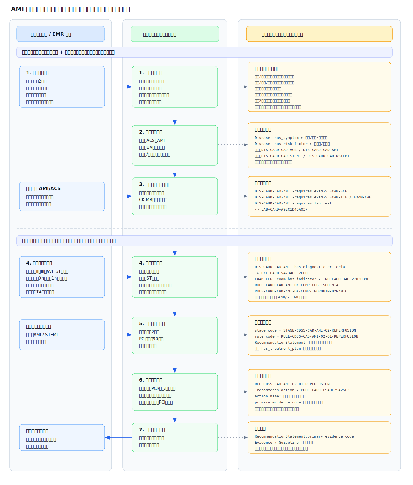

# 专病辅助诊疗建设方案：以急性心肌梗死 AMI 为例

版本：V2.0  
日期：2026-07-09  
适用范围：专科辅助诊疗、专科 CDSS、专科知识库建设、电子病历辅助应用

## 1. 核心背景

现有通用诊疗辅助系统多以基础知识提示和通用规则提醒为主，缺少面向具体专科、具体病种的专属诊疗流程和规则支撑。专科知识、临床业务流程、合理性提醒和质控要求相互分散，容易导致专科辅助诊疗碎片化、流程不统一、提醒不连续。

为满足电子病历六级中对专科疾病推荐、专科医嘱推荐、专科治疗方案推荐、专科评估、风险预测、专科模板推荐和专科医嘱质控等能力要求，需建设面向重点专科的辅助诊疗体系。系统以专科知识库为基础，结合患者全周期诊疗数据，在医生诊疗过程中提供辅助诊断、方案推荐、风险提示、模板推荐和医嘱质控提醒。

本阶段先以不少于 1 个重点专科或重点专病为样板开展建设。本文以急性心肌梗死（AMI）为示例，说明专科辅助诊疗能力如何落地。

### 1.1 六级评级对标要求

本项目重点对标以下建设要求：

| 序号 | 评级要求 | 本项目建设内容 |
|---|---|---|
| 1 | 支持专科疾病推荐、鉴别方法推荐、专科医嘱推荐 | 建设疾病提示、鉴别诊断提示、检查检验和用药医嘱建议 |
| 2 | 支持病因分析 | 结合病史、危险因素、检查检验结果，提示可能病因或诱因 |
| 3 | 支持专科治疗方案推荐 | 根据专病诊疗规范，提供治疗方案参考 |
| 4 | 支持专科评估 | 支持病情评估、风险评估、治疗条件评估 |
| 5 | 支持基于专科疾病模型进行风险预测 | 基于专科规则和风险因素，提供疾病进展、并发症和治疗风险提示 |
| 6 | 至少具备不少于 1 个专科诊疗体系 | 以 AMI 为示例建设专病辅助诊疗体系 |
| 7 | 支持专科模板推荐 | 根据患者病情和诊疗阶段推荐专科病历、评估或随访模板 |
| 8 | 支持手术及评估模板推荐 | 针对手术或介入治疗场景，推荐相关术前评估、知情、记录和术后观察模板 |
| 9 | 支持专科医嘱质控 | 结合指南、诊疗规范和患者数据，对不合理医嘱给出提醒 |

### 1.2 评级场景对应关系

| 业务场景 | 智慧医疗评级 | 主要评价内容 | 功能建设内容 |
|---|---|---|---|
| 病房医嘱处理 | 六级-01.01.6（4） | 有专科医嘱字典；下达医嘱时，可利用患者诊疗数据、专科知识库及医师主观描述，包括病历、体征、检查、检验、用药等，综合进行诊疗方案推荐，并对不合理医嘱实时给出提示。 | 1. 专科疾病智能识别推荐功能；2. 专科医嘱智能推荐功能；3. 专科医嘱合理性提醒功能。 |
| 处方书写 | 六级-03.01.6（4） | 建立针对不同专科、病种的诊疗模型，结合患者全周期数据，形成风险预测模型。 | 1. 专科疾病病因分析功能；2. 专病风险评估与提示功能；3. 用药风险提示功能。 |
| 知识获取及管理 | 六级-12.02.6（6） | 医疗机构不少于 1 个专科，重点专科优先，具备专科数据库，并纳入医疗机构知识库统一管理。 | 1. 专科知识库建设；2. 专病知识结构整理；3. 指南、诊疗规范和临床路径依据管理。 |
| 病房病历记录 | 六级-01.04.6（2） | 可根据患者情况智能推荐专科模板；可根据患者全周期诊疗数据，包括病史、体征、检查、检验、用药、护理记录等，对书写内容进行智能检查与提示。 | 1. 专科病历模板推荐功能；2. 专科评估模板推荐功能；3. 书写内容完整性检查与提示功能。 |

中医病历相关四诊和证候规则不纳入本阶段建设范围。

## 2. 建设目标

本项目围绕专科辅助诊疗场景，基于医院现有电子病历、检查检验、医嘱、用药及诊疗过程数据，结合专科指南、临床路径、诊疗规范和专家经验，建设面向医生诊疗过程的专科辅助诊疗能力。

系统不替代医生诊断和治疗决策，主要作为医生诊疗过程中的辅助工具，为医生提供疾病提示、诊断依据、检查建议、治疗方案参考、风险提示和合理性提醒，帮助医生提高诊疗效率，减少遗漏，规范诊疗行为。

本方案以急性心肌梗死（AMI）为示例，说明专科辅助诊疗系统如何围绕一个专病开展知识整理、规则建设和临床应用。

## 3. 建设思路

传统方式建设专科辅助诊疗知识库，通常需要人工逐条阅读指南、教材和临床路径，再手工整理疾病、症状、检查、检验、药物、治疗方案、诊断标准和指南依据，工作量大、周期长，也容易出现遗漏。

引入 AI 后，可辅助完成医学资料梳理、知识归类、规则初步整理和结构化录入，形成专科辅助诊疗知识底座。人工专家主要负责审核和确认关键医学内容，减少重复整理工作，提高知识库建设效率。

整体建设思路为：

```text
专科资料整理
  -> 专科知识结构化
  -> 辅助诊疗规则梳理
  -> 与患者诊疗数据结合
  -> 输出辅助诊断、治疗建议、风险提示和合理性提醒
```

## 4. 建设内容

### 4.1 专科知识库建设

围绕专科疾病建立基础知识库，整理疾病定义、常见症状、体征、检查、检验、诊断标准、鉴别诊断、治疗方案、常用药物、风险因素和指南依据等内容。

以 AMI 为例，知识库可包括：

| 类别 | AMI 示例内容 |
|---|---|
| 疾病 | 急性心肌梗死、ST 段抬高型心肌梗死、非 ST 段抬高型心肌梗死 |
| 症状体征 | 胸痛、胸闷、出汗、恶心呕吐、呼吸困难、血压异常 |
| 检查 | 心电图、超声心动图、冠脉 CTA、冠脉造影 |
| 检验 | 肌钙蛋白、肌酸激酶同工酶、BNP/NT-proBNP、D-二聚体、肾功能 |
| 诊断标准 | 心肌损伤标志物升高、心电图动态改变、缺血症状、影像学证据 |
| 鉴别诊断 | 主动脉夹层、肺栓塞、心绞痛、急性心包炎 |
| 治疗方案 | 抗血小板治疗、抗凝治疗、再灌注治疗、PCI、溶栓治疗、二级预防 |
| 风险提示 | 出血风险、再梗风险、心衰风险、心律失常风险、药物禁忌风险 |

### 4.2 专科辅助诊断

系统根据患者主诉、病史、体征、检查检验结果等信息，结合专科疾病知识和诊断规则，对可能疾病进行提示，并给出相应诊断依据和建议补充的检查检验项目。

以 AMI 为例：

```text
患者出现胸痛、出汗，心电图提示 ST 段抬高，心肌肌钙蛋白升高。
系统可提示：需关注急性心肌梗死可能。
系统可展示：支持诊断的症状、心电图表现、肌钙蛋白结果。
系统可建议：完善心电图动态复查、心肌损伤标志物复查、必要时评估冠脉情况。
```

该功能主要用于辅助医生快速定位诊疗方向，减少关键疾病漏判风险。

### 4.3 病因分析与鉴别方法推荐

系统结合患者既往史、危险因素、症状体征、检查检验结果和疾病知识，为医生提供可能病因、诱因和鉴别诊断方向提示。

以 AMI 为例：

```text
患者存在高血压、糖尿病、吸烟史、血脂异常等危险因素。
系统可提示：需关注冠状动脉粥样硬化相关风险。
患者表现为胸痛，但同时存在撕裂样疼痛、血压双侧不一致等情况。
系统可提示：需关注主动脉夹层等鉴别诊断。
```

该功能用于辅助医生梳理病因线索和鉴别方向，不作为自动诊断结论。

### 4.4 个性化诊疗方案辅助推荐

系统结合患者诊断结果、病情严重程度、检查检验指标、合并症、药物过敏史、既往用药和禁忌证等信息，为医生提供诊疗方案参考。

以 AMI 为例：

```text
若患者高度疑似 STEMI，系统可提示医生评估再灌注治疗条件。
若具备 PCI 条件，可提示优先评估急诊 PCI。
若不能及时 PCI，可提示评估溶栓适应证和禁忌证。
若存在活动性出血、疑似主动脉夹层等风险，系统可提示相关治疗需谨慎。
```

该功能仅提供辅助建议和依据展示，最终诊疗方案由医生结合患者实际情况确定。

### 4.5 专科评估与专病风险提示

系统结合专病特点和患者实时诊疗数据，对疾病严重程度、治疗条件、并发症风险、治疗风险和不良事件风险进行提示，帮助医生及时关注重点风险因素。

以 AMI 为例，系统可提示：

| 风险类型 | 提示内容示例 |
|---|---|
| 疾病进展风险 | 持续胸痛、心电图动态变化、肌钙蛋白持续升高 |
| 治疗风险 | 出血风险、溶栓禁忌、肾功能异常、药物过敏 |
| 并发症风险 | 心律失常、心力衰竭、休克、再梗 |
| 用药风险 | 抗凝、抗血小板药物相关出血风险及禁忌提醒 |

该部分以“风险提示”为主，不在合同口径中承诺复杂预测模型或自动诊断结论。

### 4.6 诊疗过程合理性提醒与专科医嘱质控

系统可在检查检验申请、用药、治疗方案选择等关键环节提供辅助提醒，帮助医生规范诊疗行为。

以 AMI 为例，系统可支持：

- 检查检验适宜性提醒：如胸痛患者建议关注心电图、肌钙蛋白等关键检查检验。
- 重复检查提醒：对短时间内重复申请的检查检验进行提示。
- 用药合理性提醒：结合患者过敏史、肾功能、出血风险等信息进行提醒。
- 禁忌证提醒：如疑似主动脉夹层或活动性出血时，提示相关治疗风险。
- 诊疗依据提示：展示相关指南、诊疗规范或临床路径依据。

该功能定位为辅助提醒，不替代医院既有医嘱审核、药师审核和医生最终判断。

### 4.7 专科模板推荐

系统可根据患者疾病类型、诊疗阶段和当前病情，推荐相应的专科病历模板、评估模板、治疗记录模板、术前或介入评估模板、出院随访模板等，辅助医生规范书写。

以 AMI 为例，系统可推荐：

| 场景 | 推荐模板示例 |
|---|---|
| 胸痛接诊 | 胸痛病历记录模板、急性冠脉综合征初筛模板 |
| AMI 诊断评估 | AMI 诊断依据记录模板、鉴别诊断记录模板 |
| PCI 或溶栓评估 | 再灌注治疗评估模板、介入治疗术前评估模板、溶栓禁忌证评估模板 |
| 治疗后观察 | 术后观察记录模板、出血风险评估模板、并发症观察模板 |
| 出院随访 | AMI 二级预防随访模板、用药宣教模板 |

本阶段重点支持专科模板推荐和介入/治疗评估模板推荐；普通外科手术全流程模板可作为后续扩展。

## 5. AMI 辅助诊疗应用示例

本章说明“图谱三元组怎么被系统使用”。以下内容以最新 `专科知识图谱Schema标准.md` V1.15 为准。

### 5.1 图谱如何类比 Oracle 表

可将图谱理解为两类数据：

| 图谱对象 | 类比 Oracle | 说明 |
|---|---|---|
| `KGNode` | 主数据表 | 存疾病、症状、检查、检验、治疗方案、规则、证据等实体 |
| `KGRelation` | 关联表 | 存 `source_code`、`relationType`、`target_code`，表达实体之间的关系 |

三元组示例：

```text
急性心肌梗死 -requires_exam-> 心电图
```

落到关系表可理解为：

| source_code | relationType | target_code |
|---|---|---|
| DIS-CARD-CAD-AMI | requires_exam | EXAM-ECG |

系统实现时必须使用 `code` 关联，不使用中文名称做主键。

### 5.2 AMI 需要用到的核心实体

| 业务对象 | entityType | AMI 示例 |
|---|---|---|
| 疾病 | `Disease` | 急性心肌梗死 |
| 疾病分型 | `DiseaseClassification` | STEMI、NSTEMI |
| 症状 | `Symptom` | 胸痛、胸闷、出汗、恶心呕吐 |
| 体征 | `Sign` | 低血压、休克表现 |
| 危险因素 | `RiskFactor` | 高血压、糖尿病、吸烟 |
| 检查 | `Exam` | 心电图、超声心动图、冠脉造影 |
| 检验 | `LabTest` | 心肌肌钙蛋白、肌酸激酶同工酶、肾功能、血糖、血脂检查 |
| 指标 | `ExamIndicator` | ST 段抬高、肌钙蛋白升高 |
| 诊断标准 | `DiagnosisCriteria` | 急性心肌梗死诊断标准 |
| 诊断标准明细 | `DiagnosisCriteriaComponent` | 缺血性症状、心电图缺血改变 |
| 鉴别诊断 | `DifferentialDiagnosis` | 主动脉夹层、肺栓塞 |
| 治疗方案 | `TreatmentPlan` | 再灌注治疗、抗血小板治疗 |
| 药物 | `Medication` | 阿司匹林、氯吡格雷、肝素 |
| 操作/手术 | `Procedure` | 急诊 PCI、溶栓治疗 |
| 推荐阶段 | `PathwayStage` 或阶段字段 | `STAGE-CDSS-CAD-AMI-02-REPERFUSION` 再灌注评估 |
| 临床规则 | `ClinicalRule` 或规则字段 | `RULE-CDSS-CAD-AMI-02-01-REPERFUSION` |
| 推荐陈述 | `RecommendationStatement` | `REC-CDSS-CAD-AMI-02-01-REPERFUSION` |
| 证据/指南 | `Evidence`、`Guideline` | 指南原文片段、指南来源 |

### 5.3 AMI 八步使用链路

| 步骤 | 业务场景 | AMI 示例 | 图谱查询路径 | 输出 |
|---|---|---|---|---|
| 1. 分拣输入内容 | 录入一诉五史、体征 | 胸痛2小时、出汗、恶心呕吐、高血压、糖尿病 | 输入内容先分拣为 `Symptom`、`RiskFactor` 等实体 | 形成患者事实 `patient_facts` |
| 2. 疑似疾病识别 | 根据患者事实反查疾病 | 胸痛、出汗、高危病史命中 `DIS-CARD-CAD-AMI`、`DIS-CARD-CAD-STEMI` | `Disease -has_symptom/has_sign/has_risk_factor-> 对应实体` | 提示疑似急性心肌梗死/STEMI |
| 3. 推荐检查检验 | 医生关注疑似 AMI | `EXAM-ECG` 心电图、`LAB-CARD-A9EC1D4DA037` 心肌肌钙蛋白、`EXAM-TTE` 超声心动图 | `Disease -requires_exam/requires_lab_test-> Exam/LabTest` | 输出下一步检查检验建议 |
| 4. 鉴别诊断提示 | 胸痛证据仍不完整 | `DDX-CARD-8F53C29C0798` 主动脉夹层、`DDX-CARD-881C77E90E42` 肺栓塞、急性心包炎、冠状动脉痉挛 | `Disease -differentiates_from-> DifferentialDiagnosis` | 输出需要排除的鉴别方向 |
| 5. 辅助诊断判断 | 检查检验结果返回 | `EXAM-ECG` 命中 ST 段抬高，心肌肌钙蛋白动态升高 | `Disease -has_diagnostic_criteria-> DiagnosisCriteria`，结合诊断规则 | 输出支持依据、缺失项、需鉴别项 |
| 6. 进入专病阶段 | 医生确认或关注 AMI/STEMI | 定位 `STAGE-CDSS-CAD-AMI-02-REPERFUSION` 再灌注评估阶段 | 根据推荐陈述中的 `stage_code`、`rule_code` 定位当前阶段 | 明确当前所处诊疗阶段 |
| 7. 输出治疗建议 | 按阶段规则给建议 | `REC-CDSS-CAD-AMI-02-01-REPERFUSION` 推荐评估 PCI、溶栓或冠脉造影 | `RecommendationStatement -> recommends_action` | 输出推荐动作和需补充判断的信息 |
| 8. 展示建议与证据 | 展示推荐原因 | `REC-775B4D172719135D` 关联 `EVD-5C8AE27C34EB5FAA3124-AMI` | `RecommendationStatement -> Evidence/Guideline` | 展示建议、原因、证据来源 |

注意：`has_treatment_plan` 只用于知识浏览，不能直接作为当前患者推荐。当前患者推荐必须从 `RecommendationStatement` 读取。

### 5.4 AMI 辅助诊疗流程图



这张图按泳道展示：左侧是医生和 EMR 输入，中间是辅助诊疗业务动作，右侧是图谱真实数据命中。图中使用的是当前图谱导出的 AMI/STEMI 数据锚点，不是临时编造的示例。比如“一诉五史、体征”中的“胸痛2小时、出汗、恶心呕吐、高血压、糖尿病”会先被分拣为具体实体 code，再通过图谱关系反查 AMI/STEMI，并继续串联检查检验、诊断依据和治疗建议。

图中主要真实数据锚点如下：

| 用途 | 真实 code | 名称 | 可查询关系或字段 |
|---|---|---|---|
| 疑似疾病 | `DIS-CARD-CAD-AMI` | 急性心肌梗死 | `has_symptom`、`requires_exam`、`requires_lab_test`、`has_diagnostic_criteria` |
| 疑似分型 | `DIS-CARD-CAD-STEMI` | ST段抬高型心肌梗死 | `has_symptom`、`has_risk_factor`、`requires_exam`、`requires_lab_test` |
| 症状 | `SYM-CARD-B479F36AE54A` | 胸痛 | 可反查 `Disease -has_symptom-> Symptom` |
| 症状 | `SYM-CARD-BC91622FC62F` | 出汗 | 可反查 `Disease -has_symptom-> Symptom` |
| 症状 | `SYM-CARD-1053F19CEBAD` | 恶心呕吐 | 可反查 `Disease -has_symptom-> Symptom` |
| 危险因素 | `RF-CARD-DE0A9F1FE2C8` | 高血压 | 可反查 `Disease -has_risk_factor-> RiskFactor` |
| 危险因素 | `RF-CARD-26FAEB71ABE2` | 糖尿病 | 可反查 `Disease -has_risk_factor-> RiskFactor` |
| 检查 | `EXAM-ECG` | 心电图 | `Disease -requires_exam-> Exam` |
| 检验 | `LAB-CARD-A9EC1D4DA037` | 心肌肌钙蛋白 | `Disease -requires_lab_test-> LabTest` |
| 检查指标 | `IND-CARD-340F2703D39C` | ST段抬高 | `Exam -exam_has_indicator-> ExamIndicator` |
| 诊断标准 | `DXC-CARD-547346EE2FED` | 急性心肌梗死诊断标准 | `Disease -has_diagnostic_criteria-> DiagnosisCriteria` |
| 鉴别诊断 | `DDX-CARD-8F53C29C0798` | 主动脉夹层 | `Disease -differentiates_from-> DifferentialDiagnosis` |
| 鉴别诊断 | `DDX-CARD-881C77E90E42` | 肺栓塞 | `Disease -differentiates_from-> DifferentialDiagnosis` |
| 推荐陈述 | `REC-CDSS-CAD-AMI-02-01-REPERFUSION` | AMI再灌注评估推荐 | `recommends_action`，动作 `PROC-CARD-E9ADC25A25E3` |
| 推荐证据 | `REC-775B4D172719135D` | 肌钙蛋白动态变化推荐 | `primary_evidence_code=EVD-5C8AE27C34EB5FAA3124-AMI` |

### 5.5 AMI 完整模拟案例

这个案例用于诊疗推荐页联调。第一步只录入一诉五史和体征，系统应输出“疑似诊断”和“下一步检查检验”；第二步回填检查检验报告后，再收敛到 AMI/STEMI 并输出治疗建议。

一诉五史不是填完就结束，也不是所有内容都用来“推诊断”。可以简单理解为：主诉和现病史负责判断“像不像这个病”，既往史、个人史、家族史负责判断“风险高不高”，过敏史负责后面“用药和治疗安不安全”。系统先把这些内容拆开，再在不同环节重复使用。

| 输入字段 | 系统主要看什么 | 在疑似诊断里怎么用 | 后面还怎么用 |
|---|---|---|---|
| 主诉 | 这次为什么来看病，如胸痛2小时 | 是疑似诊断的入口。出现胸痛、胸闷等当前症状，系统才会考虑 AMI/ACS | 决定先推荐心电图、心肌肌钙蛋白等检查 |
| 现病史 | 胸痛怎么痛、持续多久、有没有出汗/恶心呕吐/放射痛 | 用来判断这个胸痛像不像缺血性胸痛，疑似程度会更高 | 用来判断是否急、是否要排除主动脉夹层、肺栓塞等 |
| 既往史 | 高血压、糖尿病、冠心病史等 | 只能说明风险更高，不能单独推出 AMI | 用于风险分层、检查加急、治疗安全性评估 |
| 个人史 | 吸烟、肥胖、长期饮酒等 | 也是风险背景，只加分，不单独推诊断 | 用于危险因素管理、出院宣教和随访 |
| 家族史 | 直系亲属早发冠心病、心梗等 | 作为心血管高危背景 | 用于风险提示和长期管理 |
| 过敏史 | 药物过敏、造影剂过敏等 | 不参与疑似诊断 | 后续开药、造影、介入前做安全提醒 |
| 体格检查 | 低血压、心率快、皮肤湿冷、休克表现等 | 说明病情可能更重，提升紧急程度 | 用于判断是否急诊处理、是否存在休克或并发症 |

所以，这条数据链路可以用人话理解为：

```text
先看主诉和现病史：有没有这次发作的胸痛、出汗、恶心呕吐
  -> 有，才进入 AMI/ACS 疑似诊断
再看既往史、个人史、家族史：有没有高血压、糖尿病、吸烟等高危背景
  -> 有，只提高风险等级，不单独生成诊断
然后推荐下一步检查：心电图、心肌肌钙蛋白、超声心动图等
  -> 报告回来后，再判断是否支持 AMI/STEMI
最后再看过敏史、出血风险、PCI可及性等
  -> 用于治疗建议和安全提醒
```

**第一阶段：医生录入一诉五史**

| 字段 | 模拟输入 | 系统应识别的图谱实体 |
|---|---|---|
| 姓名/年龄/科室 | 张某，男，58岁，心血管内科 | 基础上下文 |
| 主诉 | 胸痛2小时 | `SYM-CARD-B479F36AE54A` 胸痛 |
| 现病史 | 胸骨后压榨样疼痛，持续不缓解，伴出汗、恶心呕吐 | 胸痛、`SYM-CARD-BC91622FC62F` 出汗、`SYM-CARD-1053F19CEBAD` 恶心呕吐 |
| 既往史 | 高血压10年，糖尿病5年 | `RF-CARD-DE0A9F1FE2C8` 高血压、`RF-CARD-26FAEB71ABE2` 糖尿病 |
| 个人史 | 吸烟30年 | `RiskFactor=吸烟` |
| 家族史 | 父亲有冠心病史 | 心血管高危背景 |
| 过敏史 | 否认药物过敏史 | 用药安全背景 |
| 体格检查 | 血压95/60mmHg，心率110次/分，皮肤湿冷 | 低血压、心动过速、皮肤湿冷 |

**第一阶段预期输出：疑似诊断**

| 展示位置 | 输出内容 | 说明 |
|---|---|---|
| 推荐诊断 | 急性冠脉综合征、急性心肌梗死、不稳定型心绞痛 | 仅为疑似诊断，不是最终诊断 |
| 待分型提示 | STEMI/NSTEMI 待心电图和心肌肌钙蛋白确认 | 没有报告前不能直接确诊 |
| 命中依据 | 胸痛、出汗、恶心呕吐、高血压、糖尿病、吸烟 | 高血压、糖尿病、吸烟只作为危险因素 |
| 下一步建议 | 完善心电图、心肌肌钙蛋白、肌酸激酶同工酶、超声心动图、肾功能、血糖、血脂检查 | 来自 `requires_exam`、`requires_lab_test` |
| 鉴别提醒 | 主动脉夹层、肺栓塞、急性心包炎、冠状动脉痉挛 | 来自 `differentiates_from` |

第一阶段可模拟请求：

```json
{
  "patient_context": {
    "name": "张某",
    "sex": "男",
    "age": 58,
    "department": "心血管内科"
  },
  "chief_complaint": "胸痛2小时",
  "present_illness": "胸骨后压榨样疼痛，持续不缓解，伴出汗、恶心呕吐",
  "past_history": "高血压10年，糖尿病5年",
  "personal_history": "吸烟30年",
  "family_history": "父亲有冠心病史",
  "allergy_history": "否认药物过敏史",
  "physical_exam": "血压95/60mmHg，心率110次/分，皮肤湿冷"
}
```

第一阶段推荐返回：

```json
{
  "stage": "initial_suspected_diagnosis",
  "recommendations": [
    {
      "disease_code": "DIS-CARD-CAD-ACS",
      "disease_name": "急性冠脉综合征",
      "recommendation_role": "suspected_diagnosis",
      "hit_symptoms": ["胸痛", "出汗", "恶心呕吐"],
      "hit_risk_factors": ["高血压", "糖尿病", "吸烟"],
      "next_step": ["EXAM-ECG", "LAB-CARD-A9EC1D4DA037"]
    },
    {
      "disease_code": "DIS-CARD-CAD-AMI",
      "disease_name": "急性心肌梗死",
      "recommendation_role": "suspected_diagnosis",
      "hit_symptoms": ["胸痛", "出汗", "恶心呕吐"],
      "hit_risk_factors": ["高血压", "糖尿病", "吸烟"],
      "next_step": ["EXAM-ECG", "LAB-CARD-A9EC1D4DA037"]
    }
  ],
  "risk_context": ["高血压", "糖尿病", "吸烟"],
  "differentials": ["主动脉夹层", "肺栓塞", "急性心包炎", "冠状动脉痉挛"]
}
```

**第二阶段：医生关注 AMI 后推荐检查检验**

| 推荐项目 | 图谱 code | 用途 |
|---|---|---|
| 心电图 | `EXAM-ECG` | 判断 ST 段抬高/压低、缺血性改变 |
| 心肌肌钙蛋白 | `LAB-CARD-A9EC1D4DA037` | 判断心肌损伤及动态变化 |
| 肌酸激酶同工酶 | `LAB-CARD-960C7CE8E22B` | 辅助判断心肌损伤 |
| 超声心动图 | `EXAM-TTE` | 评估室壁运动异常、心功能 |
| 冠状动脉造影 | `EXAM-CAG` | 评估冠脉责任病变 |
| 肾功能、血糖、血脂检查 | `LabTest` | 治疗安全性和危险因素评估 |

**第三阶段：报告回填**

| 报告类型 | 模拟结果 | 命中的图谱对象 |
|---|---|---|
| 心电图 | II、III、aVF 导联 ST 段抬高 | `IND-CARD-340F2703D39C` ST段抬高 |
| 心肌肌钙蛋白 | 0h 升高，1h 复查继续升高 | 肌钙蛋白升高及动态变化 |
| 超声心动图 | 下壁节段性室壁运动异常 | 新发室壁运动异常 |
| 主动脉 CTA | 未见主动脉夹层征象 | 主动脉夹层鉴别已排除 |

第二阶段回填请求：

```json
{
  "focused_disease_code": "DIS-CARD-CAD-AMI",
  "exam_results": {
    "EXAM-ECG": "II、III、aVF导联ST段抬高",
    "EXAM-TTE": "下壁节段性室壁运动异常",
    "aortic_dissection_excluded": true
  },
  "lab_results": {
    "LAB-CARD-A9EC1D4DA037": "心肌肌钙蛋白0h升高，1h复查继续升高",
    "LAB-CARD-960C7CE8E22B": "肌酸激酶同工酶升高"
  },
  "clinical_facts": {
    "onset_hours": 2,
    "pci_available_minutes": 90,
    "active_bleeding": false
  }
}
```

**第四阶段：诊断收敛**

| 判断项 | 结果 | 系统输出 |
|---|---|---|
| 缺血性症状 | 胸痛持续不缓解 | 支持 AMI |
| 心电图证据 | ST 段抬高 | 支持 STEMI 分型 |
| 心肌损伤证据 | 心肌肌钙蛋白升高并动态变化 | 支持 AMI |
| 影像学证据 | 节段性室壁运动异常 | 辅助支持 |
| 鉴别诊断 | 主动脉夹层已排除 | 可进入再灌注评估 |

诊断收敛输出：

```json
{
  "stage": "diagnosis_check",
  "diagnosis": {
    "disease_code": "DIS-CARD-CAD-AMI",
    "disease_name": "急性心肌梗死",
    "subtype_code": "DIS-CARD-CAD-STEMI",
    "subtype_name": "ST段抬高型心肌梗死",
    "supporting_evidence": ["胸痛持续不缓解", "ST段抬高", "心肌肌钙蛋白动态升高", "节段性室壁运动异常"],
    "differential_status": ["主动脉夹层已排除", "肺栓塞需结合临床继续评估"]
  }
}
```

**第五阶段：治疗建议**

| 条件 | 模拟值 | 推荐输出 |
|---|---|---|
| 发病时间 | 2小时 | 符合再灌注评估时间窗 |
| PCI 可及性 | 90分钟内可及 | 推荐评估急诊 PCI |
| 主动脉夹层 | 已排除 | 不阻断再灌注评估 |
| 活动性出血 | 无 | 可继续评估抗栓/介入治疗 |

治疗建议输出：

```json
{
  "stage": "treatment_suggest",
  "stage_code": "STAGE-CDSS-CAD-AMI-02-REPERFUSION",
  "recommendation_code": "REC-CDSS-CAD-AMI-02-01-REPERFUSION",
  "recommendation_text": "AMI患者应结合分型、时间窗和PCI可及性评估急诊PCI、溶栓或冠脉造影。",
  "recommended_actions": [
    {
      "action_code": "PROC-CARD-E9ADC25A25E3",
      "action_name": "经皮冠状动脉介入治疗"
    }
  ],
  "missing_or_attention": ["确认PCI可及性", "评估出血风险", "持续关注肺栓塞等鉴别诊断"]
}
```

### 5.6 一开始写什么会命中 AMI 疑似诊断

系统第一步不是让医生写诊断，而是从主诉、现病史、既往史、体征等内容中识别 AMI 相关线索。只要录入内容命中图谱中的 `Symptom`、`Sign`、`RiskFactor`，系统即可把 AMI 作为疑似疾病提示出来。

| 录入位置 | 医生可能填写内容 | 命中的图谱实体 | 关系路径 | 作用 |
|---|---|---|---|---|
| 主诉 | 胸痛、胸闷、胸痛 2 小时、压榨样胸痛 | `Symptom=胸痛/胸闷` | `Disease -has_symptom-> Symptom` | 触发 AMI/ACS 疑似疾病提示 |
| 现病史 | 疼痛持续不缓解、伴出汗、伴恶心呕吐、活动后加重、放射至左肩背 | `Symptom=出汗/恶心呕吐/胸痛` | `Disease -has_symptom-> Symptom` | 增强 AMI 疑似程度 |
| 既往史 | 冠心病史、高血压、糖尿病、高脂血症 | `RiskFactor=冠心病史/高血压/糖尿病/血脂异常` | `Disease -has_risk_factor-> RiskFactor` | 增强心血管高危背景 |
| 个人史 | 长期吸烟、肥胖、长期饮酒、缺乏运动 | `RiskFactor=吸烟/肥胖` | `Disease -has_risk_factor-> RiskFactor` | 增强风险提示 |
| 体征 | 低血压、心动过速、休克表现、皮肤湿冷 | `Sign=低血压/心动过速/休克/皮肤湿冷` | `Disease -has_sign-> Sign` | 提示重症或并发症风险 |

最小命中示例：

```text
主诉：胸痛2小时
现病史：胸痛持续不缓解，伴出汗、恶心呕吐
既往史：高血压、糖尿病
```

系统匹配逻辑：

```text
胸痛、出汗、恶心呕吐
  -> 命中 Symptom
  -> 反查 Disease -has_symptom-> Symptom
  -> 命中急性心肌梗死/急性冠脉综合征

高血压、糖尿病
  -> 命中 RiskFactor
  -> 反查 Disease -has_risk_factor-> RiskFactor
  -> 增强 AMI 疑似提示
```

输出示例：

```text
疑似疾病提示：急性冠脉综合征、急性心肌梗死。
命中依据：胸痛、出汗、恶心呕吐、高血压、糖尿病。
建议：完善心电图、肌钙蛋白等检查检验，并关注主动脉夹层、肺栓塞等鉴别诊断。
```

建议命中规则：

| 命中情况 | 系统动作 |
|---|---|
| 命中胸痛/胸闷等核心症状 | 提示关注 ACS/AMI |
| 核心症状 + 出汗/恶心呕吐 | 提高 AMI 疑似优先级 |
| 核心症状 + 高血压/糖尿病/吸烟等危险因素 | 提示心血管高危背景 |
| 核心症状 + 低血压/休克表现 | 提示重症风险，建议尽快完善检查 |

### 5.7 关注 AMI 后推荐哪些检查检验

当系统提示“疑似 AMI/ACS”后，下一步不是直接给治疗，而是先补齐诊断和鉴别所需的检查检验。

| 推荐目的 | 推荐项目 | 对应实体 | 图谱关系 | 系统输出 |
|---|---|---|---|---|
| 判断是否存在心肌缺血 | 心电图、动态心电图复查 | `Exam=心电图` | `Disease -requires_exam-> Exam` | 建议立即完善心电图，关注 ST 段改变 |
| 判断是否存在心肌损伤 | 肌钙蛋白、CK-MB | `LabTest=肌钙蛋白/CK-MB` | `Disease -requires_lab_test-> LabTest` | 建议检测并动态复查心肌损伤标志物 |
| 判断心功能和并发症 | 超声心动图、BNP/NT-proBNP | `Exam=超声心动图`、`LabTest=BNP` | `requires_exam/requires_lab_test` | 评估室壁运动异常、心衰风险 |
| 排除主动脉夹层 | 主动脉 CTA、床旁超声 | 由鉴别诊断说明或业务规则提示 | `Disease -differentiates_from-> DifferentialDiagnosis` | 胸痛性质异常时提示排除主动脉夹层 |
| 排除肺栓塞 | D-二聚体、CTPA | 由鉴别诊断说明或业务规则提示 | `Disease -differentiates_from-> DifferentialDiagnosis` | 胸痛伴呼吸困难/低氧时提示排除肺栓塞 |
| 治疗安全性评估 | 血常规、肾功能、血糖、血脂检查 | `LabTest` | `requires_lab_test` | 为后续抗栓、调脂和介入治疗做基础评估 |

图谱查询主路径：

```text
急性心肌梗死
  -> requires_exam
    -> 心电图、超声心动图、冠脉造影

急性心肌梗死
  -> requires_lab_test
    -> 心肌肌钙蛋白、肌酸激酶同工酶、肾功能、血糖、血脂检查

急性心肌梗死
  -> differentiates_from
    -> 主动脉夹层、肺栓塞、急性心包炎
```

### 5.8 检查检验结果出来后怎么确定诊断

系统不直接“自动确诊”，而是把患者结果和图谱中的诊断标准明细逐项比对，给出“支持诊断依据、未满足项、需鉴别项”，由医生最终确认。

| 患者结果 | 命中的图谱实体 | 图谱关系 | 判断 |
|---|---|---|---|
| 胸痛持续不缓解 | `DiagnosisCriteriaComponent=缺血性症状` | `DiagnosisCriteria -has_diagnostic_component-> DiagnosisCriteriaComponent` | 支持 AMI 诊断依据 |
| 心电图 ST 段抬高 | `ExamIndicator=ST段抬高` | `DiagnosisCriteria -has_diagnostic_component-> ExamIndicator` | 支持 STEMI 判断 |
| 肌钙蛋白升高并动态变化 | `ThresholdRule=肌钙蛋白动态升高` | `DiagnosisCriteria -has_diagnostic_component-> ThresholdRule` | 支持心肌损伤判断 |
| 超声提示新发室壁运动异常 | `DiagnosisCriteriaComponent=新发室壁运动异常` | `has_diagnostic_component` | 辅助支持诊断 |
| 主动脉 CTA 提示异常 | `DifferentialDiagnosis=主动脉夹层` | `Disease -differentiates_from-> DifferentialDiagnosis` | 提示需优先鉴别，不应直接进入溶栓路径 |

诊断判断主路径：

```text
急性心肌梗死
  -> has_diagnostic_criteria
    -> 急性心肌梗死诊断标准
      -> has_diagnostic_component
        -> 缺血性症状
        -> 缺血性心电图改变
        -> 肌钙蛋白升高及动态变化
        -> 新发室壁运动异常
```

输出示例：

```text
诊断依据提示：当前资料支持急性心肌梗死。
已满足：胸痛、ST 段抬高、肌钙蛋白升高并动态变化。
仍需关注：主动脉夹层、肺栓塞等鉴别诊断是否已排除。
下一步：进入 AMI/STEMI 治疗路径评估。
```

### 5.9 有诊断后推荐什么治疗方案或路径

诊断明确后，系统分两层输出：先展示疾病可用治疗方案，再根据患者条件触发当前患者推荐。

| 层级 | 用途 | 图谱关系 | AMI 示例 |
|---|---|---|---|
| 知识浏览层 | 展示该疾病通常有哪些治疗方案 | `Disease -has_treatment_plan-> TreatmentPlan` | 再灌注治疗、抗血小板治疗、抗凝治疗、二级预防 |
| 方案组成层 | 展示方案包含哪些药物/操作 | `TreatmentPlan -includes_medication/includes_procedure-> Medication/Procedure` | 阿司匹林、氯吡格雷、急诊 PCI、溶栓治疗 |
| 患者推荐层 | 根据当前患者条件给推荐 | `RecommendationStatement` 的 `stage_code`、`rule_code` 和 `recommends_action` | `REC-CDSS-CAD-AMI-02-01-REPERFUSION` 推荐评估 PCI、溶栓或冠脉造影 |

患者级推荐主路径：

```text
RecommendationStatement
  code = REC-CDSS-CAD-AMI-02-01-REPERFUSION
  stage_code = STAGE-CDSS-CAD-AMI-02-REPERFUSION
  rule_code = RULE-CDSS-CAD-AMI-02-01-REPERFUSION
  recommends_action
    -> PROC-CARD-E9ADC25A25E3
       经皮冠状动脉介入治疗
```

输出示例：

```text
当前阶段：AMI 再灌注评估阶段。
推荐动作：结合分型、时间窗和 PCI 可及性评估 PCI、溶栓或冠脉造影。
动作实体：PROC-CARD-E9ADC25A25E3，经皮冠状动脉介入治疗。
关注信息：主动脉夹层、肺栓塞等鉴别是否已排除，以及出血风险、PCI 可及性等。
```

### 5.10 关键图谱语法示例

**疑似疾病识别**

```cypher
MATCH (d:KGNode {entityType:'Disease'})
OPTIONAL MATCH (d)-[:has_symptom]->(s:KGNode {entityType:'Symptom'})
OPTIONAL MATCH (d)-[:has_risk_factor]->(rf:KGNode {entityType:'RiskFactor'})
WHERE s.name IN $symptom_names OR rf.name IN $risk_factor_names
RETURN d.code AS disease_code,
       coalesce(d.display_name, d.name) AS disease_name,
       collect(DISTINCT s.name) AS hit_symptoms,
       collect(DISTINCT rf.name) AS hit_risk_factors
ORDER BY size(hit_symptoms) + size(hit_risk_factors) DESC
```

**推荐检查检验**

```cypher
MATCH (d:KGNode {entityType:'Disease', code:$disease_code})
OPTIONAL MATCH (d)-[:requires_exam]->(exam:KGNode {entityType:'Exam'})
OPTIONAL MATCH (d)-[:requires_lab_test]->(lab:KGNode {entityType:'LabTest'})
RETURN collect(DISTINCT exam{.code, .name}) AS exams,
       collect(DISTINCT lab{.code, .name}) AS lab_tests
```

**诊断标准明细**

```cypher
MATCH (d:KGNode {entityType:'Disease', code:$disease_code})
      -[:has_diagnostic_criteria]->(dx:KGNode {entityType:'DiagnosisCriteria'})
OPTIONAL MATCH (dx)-[:has_diagnostic_component]->(comp:KGNode)
RETURN dx.code AS criteria_code,
       coalesce(dx.display_name, dx.name) AS criteria_name,
       collect(DISTINCT comp{.code, .entityType, .name}) AS components
```

**鉴别诊断**

```cypher
MATCH (d:KGNode {entityType:'Disease', code:$disease_code})
      -[:differentiates_from]->(ddx:KGNode {entityType:'DifferentialDiagnosis'})
RETURN ddx.code AS differential_code,
       coalesce(ddx.display_name, ddx.name) AS differential_name,
       ddx.description AS differential_note
```

**患者级治疗推荐**

```cypher
MATCH (rs:KGNode {entityType:'RecommendationStatement'})
WHERE rs.code = 'REC-CDSS-CAD-AMI-02-01-REPERFUSION'
   OR rs.stage_code = 'STAGE-CDSS-CAD-AMI-02-REPERFUSION'
OPTIONAL MATCH (rs)-[:recommends_action]->(action:KGNode)
OPTIONAL MATCH (rs)-[:derived_from]->(ev:KGNode {entityType:'Evidence'})
OPTIONAL MATCH (rs)-[:based_on_guideline]->(g:KGNode {entityType:'Guideline'})
RETURN rs.stage_code AS stage_code,
       rs.rule_code AS rule_code,
       rs.code AS recommendation_code,
       coalesce(rs.display_name, rs.name) AS recommendation_name,
       rs.statement_text AS statement_text,
       collect(DISTINCT action{.code, .name}) AS recommended_actions,
       collect(DISTINCT ev.code)
         + CASE WHEN rs.primary_evidence_code IS NULL THEN [] ELSE [rs.primary_evidence_code] END AS evidence_codes,
       collect(DISTINCT g.name) AS guideline_names
```

### 5.11 建议封装接口

| 接口 | 输入 | 图谱关系 | 输出 |
|---|---|---|---|
| `POST /cdss/suspect-diseases` | 主诉、病史、体征 | `has_symptom`、`has_sign`、`has_risk_factor` | 疑似疾病和命中依据 |
| `GET /kg/disease/{code}/workup` | 疾病 code | `requires_exam`、`requires_lab_test` | 推荐检查检验 |
| `POST /cdss/diagnosis-check` | 疾病 code、检查检验结果 | `has_diagnostic_criteria`、`has_diagnostic_component` | 诊断依据、缺失项 |
| `GET /kg/disease/{code}/differentials` | 疾病 code | `differentiates_from` | 鉴别诊断列表 |
| `POST /cdss/treatment-suggest` | 疾病 code、患者状态 | `RecommendationStatement.stage_code`、`rule_code`、`recommends_action`、`primary_evidence_code` | 推荐动作、需补充判断的信息、证据 |

### 5.12 截图场景的正确联调口径

以下输入用于校验诊疗推荐页是否按 AMI 专病链路工作：

```text
主诉：胸痛2小时
现病史：胸痛、出汗、恶心呕吐
既往史：高血压、糖尿病
```

正确结果不应靠人工维护“AMI/ACS 优先级名单”，而应按图谱关系和患者证据自动评分。该场景下，“高血压、糖尿病”来自既往史，应作为 `RiskFactor` 参与加分，不能单独生成推荐诊断；`心电图、心肌肌钙蛋白` 尚未返回前，页面展示的是“疑似诊断/待排疾病”，不是最终诊断。

该输入下，系统应优先展示胸痛相关的疑似疾病，并提示下一步检查检验。由于尚无心电图和心肌肌钙蛋白结果，冠心病谱系内多个疾病可以处于同一疑似层级，不要求强行给出唯一第一名。示例结果如下：

| 展示层级 | 诊断候选 | 疾病 code | 命中依据 | 说明 |
|---|---|---|---|---|
| 疑似诊断 | 急性冠脉综合征 | `DIS-CARD-CAD-ACS` | 胸痛、出汗、恶心呕吐、高危因素 | 胸痛急症入口，可作为上位提示 |
| 疑似诊断 | 急性心肌梗死 | `DIS-CARD-CAD-AMI` | 胸痛、出汗、恶心呕吐、高危因素 | 需完善心电图、心肌肌钙蛋白 |
| 待分型 | ST段抬高型心肌梗死 | `DIS-CARD-CAD-STEMI` | 胸痛、高危因素 | 需等待心电图 ST 段结果进一步确认 |
| 待分型 | 非ST段抬高型心肌梗死 | `DIS-CARD-CAD-NSTEMI` | 胸痛、高危因素 | 需结合心肌肌钙蛋白和心电图动态判断 |

`不稳定型心绞痛`可与 AMI/ACS 同属胸痛相关疑似诊断，但需要通过心电图、心肌肌钙蛋白动态变化进一步区分；`心肌炎`可作为鉴别或备选诊断。`高血压`、`糖尿病`在本场景中是危险因素，只能作为命中依据和风险背景，不应作为“推荐诊断”展示，除非患者输入的是血压显著升高、靶器官损害等高血压急症证据。

可扩展排序规则建议：

```text
候选召回：
  只用当前阳性症状、体征、检查检验异常召回 Disease
  既往史、个人史、危险因素只作为加分依据，不单独召回诊断

候选评分：
  当前主诉/现病史症状命中 has_symptom：高权重
  当前体征命中 has_sign：高权重
  检查检验异常命中诊断标准或指标：最高权重
  既往史/危险因素命中 has_risk_factor：低权重
  疾病具备诊断标准、推荐检查检验、鉴别诊断、推荐陈述：结构完整度加分
  仅命中危险因素、无当前阳性症状/体征/检查异常：不进入推荐诊断列表

结果分层：
  suspected_diagnosis：当前证据支持的疑似诊断
  differential_diagnosis：需要排除的鉴别诊断
  risk_context：危险因素或既往病史，不作为本次推荐诊断
  next_step：下一步检查检验或诊疗建议

排序边界：
  症状阶段只做疑似分层，不做最终确诊排序
  同一层级疾病分数接近时允许并列展示
  心电图、心肌肌钙蛋白等结果返回后，再用诊断标准收敛到 AMI/STEMI/NSTEMI/UA 等具体诊断
```

诊疗推荐页生成诊断建议时，应至少返回以下字段，便于判断推荐是否合理：

```json
{
  "disease_code": "DIS-CARD-CAD-AMI",
  "disease_name": "急性心肌梗死",
  "hit_symptoms": ["胸痛", "出汗", "恶心呕吐"],
  "hit_risk_factors": ["高血压", "糖尿病"],
  "recommendation_role": "suspected_diagnosis",
  "next_step": ["EXAM-ECG", "LAB-CARD-A9EC1D4DA037"]
}
```

## 6. AI 提效说明

在传统建设方式下，专科辅助诊疗知识库通常依赖人工逐条整理指南、教材、临床路径和专家共识，再手工配置疾病、症状、检查、药物、诊断标准和治疗规则，建设周期较长，维护成本较高。

使用 AI 后，可辅助完成以下工作：

- 快速梳理专科指南、教材和临床路径中的关键知识；
- 自动归类疾病、症状、检查检验、药物和治疗方案；
- 辅助整理诊断依据、鉴别诊断、风险因素和用药注意事项；
- 形成标准化知识结构，便于后续系统调用；
- 减少人工初筛和重复录入工作，提高建设效率。

需要说明的是，AI 主要承担资料整理和知识结构化工作，涉及临床诊疗安全的关键规则仍需由医学专家审核确认。

## 7. 预期建设成果

项目建设完成后，可形成以下成果：

| 成果 | 内容说明 |
|---|---|
| 专科疾病知识库 | 包含疾病、症状、体征、检查、检验、药物、治疗方案、诊断标准等基础内容 |
| 专科辅助诊疗规则 | 包含辅助诊断、病因分析、鉴别推荐、检查建议、治疗方案参考、风险提示和合理性提醒 |
| AMI 专病示例 | 形成 AMI 从接诊、诊断、治疗、用药到随访的辅助诊疗示例 |
| 专科模板推荐示例 | 形成 AMI 相关病历、评估、介入或治疗、随访模板推荐示例 |
| 证据依据整理 | 梳理相关指南、诊疗规范、临床路径等依据 |
| 系统应用说明 | 明确系统在医生诊疗过程中的提示方式和使用边界 |

## 8. 验收建议

为避免验收范围过高，建议本项目以“基础辅助诊疗能力建设”为验收口径，重点验收以下内容：

1. 是否完成专科疾病、检查检验、药物、治疗方案、诊断标准等基础知识整理。
2. 是否能基于 AMI 示例展示辅助诊断、病因分析、鉴别方法推荐、检查建议、治疗方案参考和风险提示。
3. 是否能展示相关指南或诊疗规范依据。
4. 是否能对部分检查检验、用药和禁忌证场景提供合理性提醒。
5. 是否能根据 AMI 诊疗阶段推荐相关专科模板或评估模板。
6. 是否明确系统仅作为医生辅助参考，不替代医生最终诊疗决策。

不建议在基础建设阶段承诺以下内容作为硬性验收项：

- 自动完成诊断；
- 自动生成最终治疗方案；
- 实时预测所有不良事件；
- 完整替代医嘱审核或药师审核；
- 覆盖所有专科疾病和全部临床场景。

## 9. 对外描述建议

可在合同或投标文件中使用以下表述：

> 基于专科电子病历系统沉淀的患者诊疗数据，结合专科知识库、临床规则库及辅助诊疗模型，建设面向专科诊疗全过程的辅助诊疗能力。系统围绕患者病史、主诉症状、体征、检查检验结果、用药情况及诊疗过程等信息进行综合分析，为医生提供疾病辅助诊断、诊断依据提示、关联检查建议、个性化诊疗方案辅助推荐、专病风险提示，以及检查检验和用药合理性提醒等功能，辅助医生快速定位诊疗方向，规范诊疗行为，提高诊疗效率和医疗服务质量。

## 10. 一句话说明

通过 AI 辅助梳理专科疾病、症状、检查检验、药物、治疗方案和指南依据之间的关系，形成标准化专科知识结构；相比传统人工逐条整理医学知识、规则和表格的方式，可大幅减少资料梳理、知识归类和规则配置工作量，提高专科辅助诊疗知识库建设效率。
