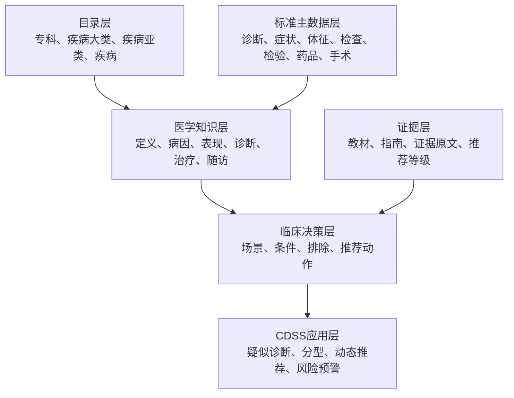

# 专科知识图谱标准字典与诊断推理执行方案

**版本：V2.0**
**日期：2026-07-21**
**状态：执行基线方案**
**适用范围：专科知识图谱、PDF解析、CDSS标准字典、术语治理、疑似疾病推理、正式CDSS推荐**

## 修改记录

| 日期 | 版本 | 修改内容 |
|---|---|---|
| 2026-07-21 | V2.0 | 明确CDSS标准字典、`K_TERM`术语库、本地YAML、教材、指南、Neo4j与规则引擎的职责；形成自动诊断作用初始化、人工维护、全库迁移和质量验收方案。 |

---

## 1. 最终目标

建设一套能够持续扩展到多学科、能够被CDSS直接使用、能够追溯到教材和指南原文、能够人工维护和版本回滚的专科知识图谱。

最终原则：

1. CDSS标准字典确定实体身份、UUID、编码和标准名称。
2. 教材建立疾病基础骨架，指南补充诊断、治疗、禁忌、随访、推荐等级和证据链。
3. `K_TERM`和本地YAML负责术语识别、同义词归一和自然语言匹配，不替代标准字典。
4. Neo4j保存已经发布的标准知识、诊断规则、推荐动作和证据关系，不作为人工直接维护入口。
5. Oracle保存标准字典、术语映射、规则配置、审核结果和版本记录。
6. 规则引擎根据患者数据执行条件判断；前端只展示结果、原因和证据，不承担图谱推理计算。
7. 所有进入正式CDSS的推荐必须能够回答：为什么推荐、适用于谁、哪些情况排除、具体执行什么、依据哪一份指南。

---

## 2. 六层总体架构



术语识别横向服务全部层级，但不将全部`K_TERM`记录创建为Neo4j节点。

---

## 3. 数据来源定位与可信边界

| 数据来源 | 正确定位 | 能否直接作为标准实体 | 使用规则 |
|---|---|---:|---|
| CDSS标准字典 | 业务标准主数据 | 是 | 只读取有效记录；名称仍需结合教材、指南和医学标准二次校验。 |
| `K_TERM_CLASS` | 诊疗术语类别树 | 否 | 用于识别术语所属类别。 |
| `K_TERM` | 独立诊疗术语库 | 否 | 用于自然语言识别、标准词候选和别名候选。 |
| `K_TERM.BACK_UP_NAME` | 页面“可选用词” | 否 | 作为兼容性别名来源，后续逐步结构化。 |
| `K_TERM_SYNONYM` | 结构化同义词明细 | 否 | 审核后写入标准实体的别名集合。 |
| 西医搜狗词库清洗数据 | 合同建设的候选术语 | 否 | 必须经过实体类别、医学规范性和标准字典映射审核。 |
| 国家中医标准术语 | 中医权威术语来源 | 条件性 | 可提高来源可信度，但仍需验证类别和标准字典映射。 |
| 本地YAML术语字典 | PDF解析沉淀的增量资产 | 否 | 进入统一术语治理流程，不再作为第二套长期主字典。 |
| 《内科学》第10版及后续权威教材 | 疾病基础骨架来源 | 否 | 提供定义、病因、临床表现、检查、诊断、治疗、随访基础内容。 |
| 诊疗指南和专家共识 | 临床决策和证据来源 | 否 | 提供诊断规则、适用人群、推荐动作、禁忌、等级和证据。 |
| 外部权威网站 | 文献不足时的补充来源 | 否 | 仅使用白名单来源；保存本地副本、访问日期和证据定位。 |
| Neo4j图谱数据库 | 发布后的知识查询库 | 否 | 不作为标准字典编辑源，不允许前端直接修改正式数据。 |

---

## 4. 标准实体范围与字典来源

以下实体范围必须完整明确，不能使用“其他”或“等”代替：

| 图谱实体类型 | 中文名称 | 标准主数据来源 | 说明 |
|---|---|---|---|
| `StandardDiagnosis` | 标准诊断 | `K_ICD10_DICT`及后续编码体系字典 | 保存标准诊断名称、编码体系、版本、编码和Oracle UUID。 |
| `Symptom` | 症状 | `K_SYMPTOM_DICT` | 患者主观感受，如胸痛、心悸、呼吸困难。 |
| `Sign` | 体征 | 新建`K_CLINICAL_SIGN_DICT` | 医生查体或观察发现，如颈静脉怒张、心包摩擦音、肺部湿啰音。 |
| `ExamItem` | 检查项目 | `K_EXAM_ITEM_DICT` | 心电图、超声心动图、CT、磁共振检查。 |
| `ExamObservation` | 检查发现 | 新建`K_EXAM_OBSERVATION_DICT` | ST段抬高、室壁运动异常、左心室射血分数降低。 |
| `LabItem` | 检验项目 | `K_LAB_ITEM_DICT` | 血常规、肝功能、肾功能、心肌损伤标志物组合。 |
| `LabSubitem` | 检验细项 | `K_LAB_SUBITEM_DICT` | 白细胞计数、红细胞计数、肌钙蛋白、肌酸激酶同工酶。 |
| `LabSpecimen` | 检验标本 | `K_LAB_SAMPLE_DICT` | 静脉血、动脉血、尿液、血浆、血清。 |
| `Medication` | 药品 | `K_DRUG_DICT` | 使用标准中文通用名称；英文缩写和中文简称进入别名。 |
| `StandardProcedure` | 标准手术/操作 | `K_OPERATION_HANDLE_DICT` | 保存CDSS可识别、可回填的标准手术或操作项目。 |
| `Procedure` | 临床手术/操作概念 | 教材、指南和临床路径 | 表达临床动作概念，并通过映射关系对应一个或多个标准手术项目。 |
| `TreatmentItem` | 其他治疗项目 | `K_TREATMENT_DICT` | 非药品、非标准手术的治疗项目。 |
| `VitalSignItem` | 生命体征项目 | 新建`K_VITAL_SIGN_ITEM_DICT` | 体温、心率、脉搏、呼吸频率、收缩压、舒张压、血氧饱和度。 |
| `MedicalTerm` | 医学术语 | `K_TERM`、`K_TERM_CLASS`、`K_TERM_SYNONYM` | 仅用于识别和映射，原则上不批量导入Neo4j。 |

### 4.1 症状、体征、生命体征边界

| 类型 | 判断标准 | 示例 |
|---|---|---|
| 症状 | 患者主观感受到的不适 | 胸痛、头晕、心悸、乏力、呼吸困难。 |
| 体征 | 医生观察、听诊、触诊或查体发现 | 颈静脉怒张、第三心音、收缩期杂音、肺部湿啰音。 |
| 生命体征 | 可以连续或重复测量的基础生理指标 | 体温、心率、脉搏、呼吸频率、血压、血氧饱和度。 |
| 阈值规则 | 生命体征或检查检验指标的判断条件 | 心率大于100次/分、收缩压低于90mmHg。 |

历史`K_SIGN_DICT`实际用于生命体征阈值配置，不得作为临床体征标准字典使用；历史`K_SIGN_SYMPTOM_DICT`属于旧规则映射，不得直接导入新体征字典。

---

## 5. 标准实体统一字段

适用于标准诊断、症状、体征、检查项目、检查发现、检验项目、检验细项、检验标本、药品、标准手术、治疗项目和生命体征项目：

| 字段 | 中文名称 | 格式要求 | 用途 |
|---|---|---|---|
| `kg_id` | 图谱稳定ID | 字符串，唯一 | Neo4j内部稳定标识。 |
| `standard_dict_table` | 标准字典表 | 字符串 | 记录主数据来自哪张Oracle字典表。 |
| `standard_dict_id` | 标准字典UUID | 字符串，必填 | Oracle字典主键，也是标准实体合并首选依据。 |
| `standard_code` | 标准编码 | 字符串 | ICD编码、药品编码、检查编码、检验编码、手术编码。 |
| `name` | 标准中文名称 | 字符串，必填 | 不得使用纯英文缩写作为主名称。 |
| `english_name` | 英文名称 | 字符串或空 | 保存规范英文全称。 |
| `aliases` | 别名集合 | 字符串数组 | 保存英文缩写、中文简称、旧称和常见表达。 |
| `valid_flag` | 有效标志 | `1`有效 | 图谱正式使用仅允许有效字典记录。 |
| `sex_limit_code` | 性别限制编码 | 字符串或空 | 使用CDSS字典编码。 |
| `age_min` | 最小年龄 | 数值或空 | 与年龄单位配套。 |
| `age_max` | 最大年龄 | 数值或空 | 与年龄单位配套。 |
| `age_unit` | 年龄单位 | 天、月、岁 | 不得只有数值没有单位。 |
| `pregnancy_limit_code` | 妊娠限制编码 | 字符串或空 | 不得由模型猜测。 |
| `lactation_limit_code` | 哺乳限制编码 | 字符串或空 | 不得由模型猜测。 |
| `source_version` | 来源版本 | 字符串 | 字典或标准版本。 |
| `synced_at` | 同步时间 | 日期时间 | 记录最近一次从Oracle同步时间。 |

标准实体合并顺序：

1. 优先使用`standard_dict_id`精确合并。
2. 其次使用同一字典、同一版本下的`standard_code`核对。
3. 名称和别名只用于候选匹配，不能直接作为最终合并主键。
4. 一个标准UUID只能对应一个有效图谱标准实体。

---

## 6. 疾病目录与临床诊断层级

目录结构保留：

```text
专科 Specialty
  └─疾病大类 DiseaseCategory
      └─疾病亚类 DiseaseSubcategory
          └─疾病 Disease
```

目录层级只负责组织和展示，临床诊断层级由疾病实体的诊断角色表达：

| 诊断角色 | 中文名称 | 用途 |
|---|---|---|
| `broad_diagnosis` | 宽口径/待分型诊断 | 用于疑似疾病或分型尚未明确时。 |
| `specific_subtype` | 具体分型 | 用于证据满足后的明确分型。 |
| `independent_diagnosis` | 独立诊断 | 不依赖宽口径分型流程的疾病。 |

示例：

```text
急性心肌梗死（宽口径/待分型诊断，I21.900）
  ├─ST段抬高型心肌梗死（具体分型）
  └─非ST段抬高型心肌梗死（具体分型）
```

核心关系：

```text
疾病亚类 -包含疾病-> 疾病
宽口径疾病 -具有临床分型-> 具体分型疾病
疾病 -对应标准诊断-> StandardDiagnosis
```

疑似诊断阶段允许推荐宽口径疾病；只有满足分型规则后才输出具体分型。

---

## 7. 知识展示与正式CDSS推荐分层

### 7.1 基础知识关系

用于疾病知识概览和候选疾病召回：

```text
疾病 -具有症状-> 症状
疾病 -具有体征-> 体征
疾病 -建议检查-> 检查项目
疾病 -建议检验-> 检验项目
疾病 -具有检查发现-> 检查发现
疾病 -具有检验指标-> 检验细项
疾病 -具有并发症-> 并发症
疾病 -具有鉴别对象-> 鉴别疾病
```

这些关系表示医学知识，不代表当前患者一定需要执行。

### 7.2 正式推荐链路

```text
疾病
→ 诊疗阶段
→ 临床场景
→ 触发条件
→ 排除条件或禁忌
→ 推荐陈述
→ 具体推荐动作
→ 原文证据
→ 指南
```

正式推荐动作只能指向以下实体：

1. 检查项目；
2. 检验项目；
3. 检验细项；
4. 药品；
5. 临床手术/操作；
6. 其他治疗项目；
7. 随访方案；
8. 风险评估；
9. 转诊或会诊动作。

### 7.3 手术双层结构

临床概念与CDSS标准手术项目必须分层：

```text
推荐陈述
→ 推荐临床手术 Procedure
→ 对应标准手术 StandardProcedure
```

当前服务器事实：

- `StandardProcedure`共49个；
- 完全孤立节点为0；
- 存在59条`临床手术 → 标准手术`映射关系；
- 37个临床手术节点全部已映射；
- 当前16条正式推荐涉及14个临床手术和17个标准手术；
- 前端不得使用`Disease → StandardProcedure`查询判断孤立。

---

## 8. 术语与本地YAML整合

### 8.1 目标结构

```text
教材、指南、病历原文
→ K_TERM与本地YAML识别名称和别名
→ 术语与标准字典映射
→ CDSS标准实体
→ 专科知识图谱和规则引擎
```

### 8.2 新增术语映射表

建议新增`K_TERM_DICT_MAPPING`，中文名称“术语与标准字典映射表”。至少包含：

| 字段 | 中文说明 |
|---|---|
| `ID` | UUID主键。 |
| `TERM_ID` | `K_TERM`术语ID。 |
| `TERM_CLASS_ID` | 术语类别ID。 |
| `DICT_TYPE` | 标准字典类型。 |
| `DICT_TABLE` | 标准字典表名。 |
| `DICT_ID` | 标准字典UUID。 |
| `DICT_CODE` | 标准编码快照。 |
| `DICT_NAME` | 标准名称快照。 |
| `MAPPING_TYPE` | 标准名、别名、英文名、缩写、旧称。 |
| `SOURCE_TYPE` | CDSS、国家标准、教材、指南、YAML、搜狗候选。 |
| `MATCH_CONFIDENCE` | 映射可信度。 |
| `REVIEW_STATUS` | 待审核、通过、驳回。 |
| `VALID_FLAG` | 有效标志。 |
| `CREATE_TIME` | 创建时间。 |
| `MODIFY_TIME` | 修改时间。 |

### 8.3 YAML处理规则

| YAML类别 | 归并目标 |
|---|---|
| 疾病同义词 | 标准诊断字典和疾病实体。 |
| 症状同义词 | 症状标准字典。 |
| 体征同义词 | 体征标准字典。 |
| 药物同义词 | 药品标准字典。 |
| 检查同义词 | 拆分为检查项目、检查发现、检验项目、检验细项。 |
| 手术同义词 | 标准手术字典和临床手术概念。 |
| 危险因素同义词 | 图谱危险因素实体和术语识别数据。 |
| 待审核队列 | 统一字典变更评审表。 |

### 8.4 合并规则

1. 标准实体已经存在：只补术语映射和别名，不创建重复实体。
2. `K_TERM`已经存在同义表达：不重复新增术语，只补标准字典映射。
3. CDSS字典和`K_TERM`均不存在：进入评审表，不直接新增Oracle业务字典。
4. CDSS名称不规范或重复：记录现状、影响范围和修改建议，不直接修改。
5. 术语类别冲突：进入待审核，不得自动入图。
6. `K_TERM_SYNONYM`作为结构化别名明细；`BACK_UP_NAME`作为兼容展示字段，后续由同义词明细生成。

---

## 9. 字典变更评审机制

建议使用持久化评审表`K_KG_DICT_CHANGE_REVIEW`，中文名称“知识图谱字典变更评审表”。

必须记录：

1. 问题类型：缺失、名称不规范、重复、类别错误、编码冲突、别名缺失；
2. 当前字典表、UUID、编码、名称、有效标志；
3. 建议动作：新增、改名、补别名、合并、停用、不处理；
4. 建议标准名称和别名；
5. 教材、指南、国家标准和外部权威证据；
6. 已有规则、医嘱映射和院内映射依赖数量；
7. 审核状态；
8. 单独执行授权；
9. 执行前快照和执行后快照；
10. 回滚语句和回滚状态。

审核通过不等于允许执行。只有`执行授权=是`的记录才允许修改Oracle业务字典。

---

## 10. 抽取置信度与诊断作用初始化

### 10.1 当前事实

- 当前疾病—症状关系983条；
- 当前疾病—体征关系825条；
- 当前不存在`diagnostic_weight`、`weight`、`frequency`和`specificity`诊断权重字段；
- 已有`confidence`主要表示PDF抽取可信度，不能当作诊断权重。

### 10.2 字段必须分开

| 字段 | 中文名称 | 用途 |
|---|---|---|
| `extraction_confidence` | 抽取置信度 | 判断知识是否被正确识别、标准化和定位。 |
| `diagnostic_effect` | 诊断作用方向 | 支持、反对、必要条件、排除条件、未判定。 |
| `weight_level` | 诊断作用等级 | 1一般、2重要、3关键；必要和排除不使用数值等级。 |
| `initialization_method` | 初始化方式 | 原文明示、诊断标准结构、表格规则、人工审核。 |
| `initialization_confidence` | 初始化可信度 | 判断自动诊断作用分类是否可靠。 |
| `runtime_suspicion_level` | 患者疑似等级 | 规则引擎实时输出，不写回知识图谱。 |

### 10.3 自动初始化规则

| 原文表达 | 自动结果 |
|---|---|
| 诊断必需、必须满足、必要条件 | `required`，必要条件。 |
| 主要诊断标准、特征性表现、高度提示、较高特异性 | `support`，等级3。 |
| 次要诊断标准、有助于诊断、重要临床表现 | `support`，等级2。 |
| 常见、可出现、部分患者伴有、辅助判断 | `support`，等级1。 |
| 不支持、与本病不符 | `against`，等级按原文强度确定。 |
| 应排除、排除后方可诊断 | `exclude`，排除条件。 |
| 原文没有表达诊断意义 | `unset`，未判定且不参与推理。 |

禁止事项：

1. 禁止根据关系名称猜测权重；
2. 禁止因为同一术语在多份文献重复出现就无限增加权重；
3. 禁止将抽取置信度乘入临床诊断得分；
4. 禁止将大模型生成的小数权重直接用于正式CDSS；
5. 禁止缺少原文证据的关系参与正式诊断推理。

### 10.4 抽取置信度计算

```text
抽取置信度 =
原始文档质量20%
+ 标准字典匹配质量25%
+ 原文关系明确程度25%
+ 证据定位完整程度20%
+ 多来源一致性10%
```

| 分值 | 处理状态 |
|---|---|
| 大于等于0.90 | 可进入正式知识层。 |
| 0.75至0.89 | 进入待复核区。 |
| 0.60至0.74 | 仅作为候选。 |
| 低于0.60 | 阻断，不入正式图谱。 |

### 10.5 复杂诊断规则

涉及“全部满足、至少满足、动态变化、阈值、时间窗”的内容不能拆成多个简单加分项，必须生成组合规则：

```text
全部满足：条件A、条件B
并且至少满足：条件C、条件D中的一项
不得出现：条件E
输出：高度疑似、可能、证据不足、不支持、已排除
```

指南已有正式评分工具时，完整保存原始公式、条目、分值、阈值、适用人群和版本，不使用通用诊断作用等级替代。

---

## 11. 自动初始化执行流程

本次初始化由解析流程完成，人工后续只审核异常和关键规则：

1. 读取教材定义、临床表现、检查检验、诊断标准和鉴别诊断章节。
2. 读取指南诊断标准、表格、流程图、阈值、推荐陈述和证据等级。
3. 将原文术语映射到CDSS标准实体。
4. 将简单特征分类为必要、关键、重要、一般、反对、排除或未判定。
5. 将复合条件生成诊断规则卡。
6. 同一疾病、同一特征、同一方向合并关系并保留全部证据。
7. 不同来源等级不同，以明确诊断标准的临床角色为主，其他来源保留为支持证据。
8. 支持与反对冲突时不自动裁决，进入冲突清单。
9. AMI和心肌病先形成样板矩阵并执行患者推理模拟。
10. 样板验收后批量覆盖其他疾病。

输出文件：

- 疾病诊断特征矩阵；
- 诊断规则卡；
- 未判定关系清单；
- 来源冲突清单；
- 关键必要条件与排除条件审核清单；
- 疑似疾病推理测试报告；
- 可入库节点和关系增量包。

---

## 12. 人工维护与版本发布

人工不直接修改Neo4j，也不逐条填写小数权重。维护对象是一张“诊断规则卡”。

建议新增：

| 表名 | 中文名称 | 用途 |
|---|---|---|
| `K_DIAGNOSIS_RULE` | 诊断规则主表 | 保存疾病、规则名称、适用人群、输出结果和版本。 |
| `K_DIAGNOSIS_RULE_ITEM` | 诊断规则条件明细 | 保存标准实体、运算符、阈值、逻辑组、作用方向和等级。 |
| `K_DIAGNOSIS_RULE_VERSION` | 诊断规则版本表 | 保存草稿、审核、发布、停用和回滚版本。 |
| `K_DIAGNOSIS_RULE_LOG` | 诊断规则修改日志 | 保存修改前后差异、操作者和修改时间。 |

规则卡至少包含：

1. 关联疾病；
2. 规则名称；
3. 适用人群；
4. 必须满足条件；
5. 至少满足条件；
6. 不支持条件；
7. 排除条件；
8. 缺失时建议补充的检查或检验；
9. 输出结果；
10. 教材或指南证据；
11. 规则版本和有效期。

发布流程：

```text
保存草稿
→ 自动结构检查
→ 病例模拟
→ 审核
→ 发布新版本
→ 同步Neo4j
→ 规则引擎加载
→ 监测使用效果
```

---

## 13. CDSS运行链路

1. 从EMR读取患者主诉、现病史、生命体征、检查结果、检验结果、诊断、用药、手术和既往史。
2. 使用CDSS标准字典、`K_TERM`、同义词和本地沉淀术语完成标准化。
3. 先执行性别、年龄、妊娠、哺乳和明确排除条件。
4. 召回可能相关的宽口径疾病。
5. 执行必要条件、支持条件、反对条件和排除条件。
6. 输出高度疑似、可能、证据不足、不支持或已排除。
7. 必要信息缺失时，优先推荐用于确认或排除的检查和检验。
8. 满足分型条件后，从宽口径疾病进入具体分型。
9. 进入对应诊疗阶段和临床场景。
10. 输出具体检查、检验、药品、手术、治疗和随访推荐。
11. 每条正式推荐同时返回主依据、支持依据、适用人群、触发条件、排除条件和原文证据。

前端不计算诊断作用和规则，只展示后端结果及原因。

---

## 14. 前端与接口要求

### 14.1 疑似疾病结果

接口至少返回：

```json
{
  "disease_code": "疾病编码",
  "disease_name": "疾病名称",
  "diagnostic_role_name": "宽口径疑似诊断",
  "runtime_suspicion_level": "高度疑似",
  "matched_required": [],
  "matched_key_support": [],
  "matched_general_support": [],
  "against_evidence": [],
  "exclusion_hit": false,
  "missing_critical_items": [],
  "evidence_sources": []
}
```

### 14.2 手术展示

知识概览展示临床手术概念；医生展开详情时展示对应的CDSS标准手术名称、编码和UUID。

前端查询路径：

```text
推荐陈述
→ 临床手术 Procedure
→ 标准手术 StandardProcedure
```

不得要求`Disease`直接连接`StandardProcedure`。

### 14.3 证据展示

医生默认只看到当前推荐对应的主证据：

- 指南名称；
- 页码或段落；
- 推荐等级；
- 证据等级；
- 原文摘要。

支持证据和历史版本按需展开，不再整页罗列全部指南和全部证据节点。

---

## 15. 性能与图谱瘦身

1. `K_TERM`的30103条术语不批量创建Neo4j节点。
2. 相同症状、体征、检查、检验、药品和手术在全图谱只保留一个标准主节点。
3. 疾病差异放在关系、诊断规则和证据上，不复制实体。
4. Evidence按“文献ID、页码、段落、原文指纹”去重。
5. 患者本次检查结果、检验结果和医嘱执行结果不作为永久知识节点。
6. 本地节点和关系文件按实体类型、疾病大类和批次拆分，使用流式读取。
7. 为标准字典UUID、标准编码、疾病编码、实体类型和有效标志建立索引。
8. 每个批次生成文件清单、数量统计和哈希，确保本地与服务器一致。

---

## 16. 质量闸门

### 16.1 标准主数据

- 有效标准实体字典映射率100%；
- 同一标准字典UUID重复节点为0；
- 同一编码体系、同一版本、同一标准编码重复节点为0；
- 主名称使用英文缩写的节点为0；
- 无标准字典依据但进入正式医嘱动作的节点为0；
- Oracle无效记录进入正式图谱为0。

### 16.2 疾病层级

- 专科、疾病大类、疾病亚类、疾病目录断链为0；
- 宽口径疾病缺少临床分型关系为0；
- 具体分型缺少父疾病为0；
- 疾病缺少标准诊断映射为0；
- 同一标准诊断映射到多个无治理疾病节点为0。

### 16.3 知识内容

- 定义空壳为0；
- 诊断标准只有标题没有组件为0；
- 鉴别诊断只有疾病名称没有鉴别规则为0；
- 检验项目与检验细项混用为0；
- 检查项目与检查发现混用为0；
- 体征、症状、生命体征类别污染为0；
- 药物类别没有具体药品且进入正式推荐为0；
- 治疗方案没有具体动作且进入正式推荐为0。

### 16.4 诊断推理

- 无原文证据但参与正式推理的关系为0；
- 抽取置信度被当作临床诊断作用为0；
- 必要条件被当作普通加分项为0；
- 排除条件被当作一般反对项为0；
- 复杂诊断标准被错误拆成简单加分关系为0；
- 来源冲突未经处理进入正式规则为0。

### 16.5 正式CDSS推荐

- 正式推荐缺少适用人群为0；
- 正式推荐缺少触发条件为0；
- 正式推荐缺少排除条件或明确“不适用”为0；
- 正式推荐缺少具体动作实体为0；
- 正式推荐缺少主证据为0；
- 临床手术缺少标准手术映射为0；
- 前端无法从推荐追溯到标准医嘱项目为0。

---

## 17. 全量实施顺序

### 阶段一：冻结与备份

1. 备份Neo4j数据库；
2. 导出节点、关系、约束、索引和数量统计；
3. 备份Oracle相关表结构和只读数据快照；
4. 冻结本地YAML、JSONL、批次台账、Schema和SKILL版本；
5. 生成备份校验哈希和恢复说明。

### 阶段二：标准字典与治理表建设

1. 建设体征标准字典；
2. 建设生命体征项目标准字典；
3. 建设检查发现标准字典；
4. 建设术语与标准字典映射表；
5. 建设字典变更评审表；
6. 建设诊断规则配置与版本表；
7. 建立唯一约束、有效标志索引和审计字段。

### 阶段三：术语和YAML整合

1. 读取`K_TERM_CLASS`、`K_TERM`、`K_TERM_SYNONYM`；
2. 读取疾病、症状、体征、药物、检查、手术、危险因素和待审核YAML；
3. 精确匹配标准字典；
4. 生成新增、别名、冲突、重复和缺失候选；
5. 经评审后写入术语映射和别名数据；
6. YAML转为版本化导出和离线缓存，不再作为正式主数据源。

### 阶段四：AMI与心肌病样板

1. 迁移疾病层级和标准诊断；
2. 迁移症状、体征、检查、检查发现、检验、检验细项、药品、临床手术和标准手术；
3. 自动初始化诊断作用；
4. 生成复杂诊断规则卡；
5. 验证宽口径疑似诊断和具体分型；
6. 验证正式推荐动作和证据链；
7. 对比迁移前后节点、关系、重复、孤立、查询和推理结果。

### 阶段五：全库迁移

1. 按疾病大类分批迁移标准主数据；
2. 每批先本地审计，再生成增量包；
3. 入库后执行服务器复核；
4. 自动阻断重复、孤立、目录断链、空壳和无证据推荐；
5. 失败批次整批回滚，不允许数据库处于半完成状态。

### 阶段六：全库诊断作用初始化

1. 先处理诊断标准和鉴别诊断；
2. 再处理检查发现和检验细项；
3. 再处理症状、体征和危险因素；
4. 输出未判定、冲突、关键必要条件和排除条件清单；
5. 使用病例模拟验证疑似疾病和分型逻辑；
6. 发布通过版本。

### 阶段七：前后端联调与上线

1. 后端提供统一图谱查询和规则执行接口；
2. Trae前端按新查询路径展示目录、知识、规则、标准医嘱和证据；
3. 使用AMI作为技术开发样板；
4. 使用心肌病验证宽口径疾病和多分型；
5. 完成旧接口兼容期和双读对比；
6. 验收通过后切换正式CDSS接口。

---

## 18. 回滚与安全控制

1. Oracle业务字典不允许未经评审直接修改。
2. 所有新增、改名、合并、停用操作必须保存前后快照。
3. Neo4j写库前保存全库备份和本批次逻辑快照。
4. 每个迁移批次必须有唯一批次号、文件清单、数量、哈希和回滚脚本。
5. 正式发布使用新版本，旧版本先停用后观察；确认无依赖后才允许物理删除。
6. 规则发布采用版本切换，不直接覆盖当前正式规则。
7. 模型不得自行修改Oracle标准字典、正式规则和已发布权重等级。

---

## 19. 最终交付物

1. 更新后的《专科知识图谱Schema标准》；
2. 更新后的《AI自动化工具-文献指南解析》；
3. Oracle新增表DDL和回滚DDL；
4. 标准字典与术语映射清单；
5. 本地YAML整合报告；
6. AMI和心肌病迁移样板包；
7. 疾病诊断特征矩阵；
8. 诊断规则卡和版本记录；
9. 全库节点、关系和标准字典映射增量包；
10. 入库前审计报告；
11. 服务器入库后复核报告；
12. 前后端接口说明；
13. Trae前端全局提示词；
14. 迁移前后成果对比报告；
15. 大版本变更记录；
16. 当前进度与后续交接文件。

---

## 20. 最终验收标准

本次升级完成必须同时满足：

1. 标准字典主数据唯一、有效、可追溯；
2. `K_TERM`和本地YAML能够映射到标准字典，不再各自形成独立主数据；
3. 疾病宽口径诊断、具体分型和标准诊断关系清晰；
4. 症状、体征、生命体征、检查、检查发现、检验项目和检验细项边界清晰；
5. 临床手术和标准手术关系完整，CDSS能够识别和回填；
6. 自动初始化的诊断作用全部具有原文证据和初始化依据；
7. 无法判断的数据保持未判定，不允许模型硬补；
8. 疑似疾病推荐能够展示支持、反对、排除和缺失的关键项目；
9. 正式推荐能够追溯到具体动作、主指南、推荐等级、证据等级和原文；
10. 本地文件、Oracle配置、Neo4j数据、规则引擎和前端展示结果一致；
11. 全部变更能够审计、回滚和按版本发布；
12. 新疾病和新指南能够复用同一流程，不再按病种临时编写一套脚本。

---

## 21. 本方案的执行边界

本文件是V2.0执行基线。本轮形成方案本身不代表已经修改Oracle、Neo4j、Schema或SKILL。正式执行时必须从“阶段一：冻结与备份”开始，依次完成字典建设、术语整合、样板迁移、全库迁移、诊断作用初始化和前后端联调，不得跳过备份和质量闸门。
